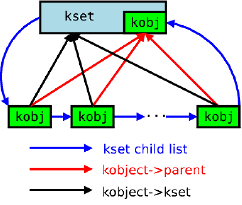

---
categories:
- Understand Linux Kernel
date: 2013-11-14T16:00:00
tags:
- linux
- kernel
- driver
title: Linux driver model
---

## 简介

Linux驱动模型最开始出现在2.5.45,当时它的出现主要是为了统一内核对象的引用计数.
而如今他的角色已经进化成设备模型和sys文件系统的粘合剂.
其中有几个概念必须要明确:

- `kobject:` 一个 `kobject` 有一个属于自己的名字和一个引用计数.同时,为了支持层级关系,也有一个指向父节点的指针,其他的还包括类型,以及在sysfs中的位置.  `kobject` 本身没有什么意义,一般它都是被嵌入在其他有意义的结构体中.
- `ktype:` 嵌入 `kobject` 的对象的类型.每个嵌入 `kobject` 的数据结构都会对应一个 `ktype` ,它主要用于控制 `kobject` 创建和销毁时的动作.
- `kset:` 一系列 `kobject` 的集合.集合中的 `kobject` 可以是同一种类型,也可以不同类型.其中, `kset` 自身也会嵌入一个 `kobject` 可以看作一个链表的头.

在sysfs中的每个文件夹就对应一个 `kobject` .

## kobject

```
struct kobject {
	const char		*name; // 名字
	struct list_head	entry; // 在kset链表中的位置
	struct kobject		*parent; // 指向父节点
	struct kset		*kset; // 指向所属的kset
	struct kobj_type	*ktype; // 指向所属的ktype
	struct sysfs_dirent	*sd; // sysfs中的位置
	struct kref		kref; // 引用计数
	unsigned int state_initialized:1; // 是否初始化
	unsigned int state_in_sysfs:1; // 是否在sysfs注册
	unsigned int state_add_uevent_sent:1; // 是否发送KOBJ_ADD事件给用户层
	unsigned int state_remove_uevent_sent:1; // 是否发送KOBJ_REMOVE时间给用户层
	unsigned int uevent_suppress:1; // 是否将发送给用户层的事件丢弃
};
```

`kobject` 内部这些字段的初始化主要通过 `kobject_init` 完成.

```
extern void kobject_init(struct kobject *kobj, struct kobj_type *ktype);
```

这里的 `ktype` 是必须的.

```
struct kobj_type {
	void (*release)(struct kobject *kobj); // 当kobject引用计数为0时的操作
	const struct sysfs_ops *sysfs_ops; // sysfs节点文件的操作集
	struct attribute **default_attrs; // sysfs该文件目录下的各个属性文件
	const struct kobj_ns_type_operations *(*child_ns_type)(struct kobject *kobj);
	const void *(*namespace)(struct kobject *kobj);
};
```

其中sysfs操作集中包括2个函数,一个负责文件的读取,一个负责文件的写入.
而这些文件就是这里的属性,其中每个属性包括名字和文件访问权限.

为了将 `kobject` 注册到sysfs中,下一步就是调用 `kobject_add`

```
int kobject_add(struct kobject *kobj, struct kobject *parent,
		const char *fmt, ...);
```

在该函数中建立起 `kobject` 对应的父节点和名字.
对于父节点的选取,如果该 `kobject` 属于特定的 `kset`,
那么必须首先设置好 `kset` 之后才能调用该函数.
如果该 `kset` 自身关联一个 `kobject`, 那么这里的 `parent` 参数可以为NULL,
那么该 `kobject` 的父节点即为 `kset` 本身.

当 `kobject` 完成注册之后,最后一步便是"向世界宣布我诞生了！",
这里是通过 `kobject_uevent` 完成的:

```
int kobject_uevent(struct kobject *kobj, enum kobject_action action);
```

该函数的逻辑主要是找到该 `kobject` 所对应的 `kset`,因为 `kset`
中会指定发送事件的方法(后面会讲到),最终调用该方法.

`kobject` 资源的释放是通过 `kobject_put` 完成的.
一般情况下,该函数只是将引用计数减一( `kobject` 初始化时,引用计数为1),
当计数为0时,发送 `KOBJ_REMOVE` 事件告知其他模块,然后释放相关资源.
如果你不想直接释放资源,只是让其对其他模块不可见,可以调用 `kobject_del` ,
该函数只是将其从sysfs中删除,但是引用计数保持不变,
当你真正需要释放该资源时,再调用 `kobject_put` 即可.

## kset

```
struct kset {
	struct list_head list; // 属于该集合的kobject的链表
	spinlock_t list_lock; // 遍历链表时的保护锁
	struct kobject kobj; // 该集合自身的kobject
	const struct kset_uevent_ops *uevent_ops; // 指定该合计所支持的事件操作集
};
```

```
struct kset_uevent_ops {
	int (* const filter)(struct kset *kset, struct kobject *kobj); // 事件过滤
	const char *(* const name)(struct kset *kset, struct kobject *kobj); // 获取子系统的名称
	int (* const uevent)(struct kset *kset, struct kobject *kobj,
		      struct kobj_uevent_env *env); // 发送事件
};
```

`kset` 和 其中的 `kobject` 的关系如下图所示:



## 总线,设备,驱动

上面说的 `kobject` 概念毕竟太底层,对于驱动开发来说,
linux为我们在此基础上又做了一次抽象,
主要抽象出了3个概念: 总线,设备和驱动.

在开始之前,有必要区分两个容易混淆的概念:总线类型和总线设备.
总线类型是关联设备和驱动的虚拟概念,只是表示一种类型.
而总线设备是一个设备,一般对应总线控制器,这是软件对硬件设备的一种抽象.

### device

`device` 结构是对设备的抽象:

```
struct device {
	struct device		*parent; // 指向父节点(一般为总线或者控制器)

	struct device_private	*p; // 设备相关的参数

	struct kobject kobj; // 指向顶层的kobject对象
	const char		*init_name; // 设备初始的名字
	const struct device_type *type; // 指向设备的类型

	struct mutex		mutex;	// 用于驱动顺序顺序化使用该设备

	struct bus_type	*bus;		// 该设备所属的总线类型
	struct device_driver *driver;	// 和该设备绑定的驱动
	void		*platform_data;	// 平台相关的信息
	struct dev_pm_info	power; // 电源管理相关
	struct dev_pm_domain	*pm_domain; // 同上

#ifdef CONFIG_NUMA
	int		numa_node;	/* NUMA node this device is close to */
#endif
	u64		*dma_mask;	/* dma mask (if dma'able device) */
	u64		coherent_dma_mask;/* Like dma_mask, but for
					     alloc_coherent mappings as
					     not all hardware supports
					     64 bit addresses for consistent
					     allocations such descriptors. */

	struct device_dma_parameters *dma_parms;

	struct list_head	dma_pools;	/* dma pools (if dma'ble) */

	struct dma_coherent_mem	*dma_mem; /* internal for coherent mem
					     override */
	/* arch specific additions */
	struct dev_archdata	archdata;

	struct device_node	*of_node; // 在设备树中的位置

	dev_t			devt;	// sysfs中的dev节点
	u32			id;	/* device instance */

	spinlock_t		devres_lock; // 保护设备的资源访问
	struct list_head	devres_head; // 设备资源

	struct klist_node	knode_class; // 在class列表中的位置
	struct class		*class; // 设备所属的class
	const struct attribute_group **groups;	/* optional groups */

	void	(*release)(struct device *dev); // 当引用计数为0时的回调函数
};
```

其中 `device_private` 比较关键,它主要是为驱动核心系统提供所有的信息.

```
struct device_private {
	struct klist klist_children; // 该设备的孩子列表
	struct klist_node knode_parent; // 在父节点的孩子列表中的位置
	struct klist_node knode_driver; // 在关联的驱动的设备列表中的位置
	struct klist_node knode_bus; // 在其所属的总线的设备列表中的位置
	struct list_head deferred_probe; // 在延迟探测列表中的位置,主要是因为有些资源暂时还无法获得,必须等待其他驱动的初始化
	void *driver_data; // 驱动相关的信息
	struct device *device; // 指向所属的class
};
```

设备的初始化由 `device_register`
完成,该函数会首先初始化device中的相关字段,
之后将初始化好的内嵌 `kobject` 添加到系统中.

### driver

```
struct device_driver {
	const char		*name; // 驱动的名字
	struct bus_type		*bus; // 该驱动绑定的设备所属的总线类型

	struct module		*owner; // 该驱动所属的模块
	const char		*mod_name;	// 内建模块的名字

	bool suppress_bind_attrs;	// 是否允许通过sysfs绑定/解绑

	const struct of_device_id	*of_match_table; // 帮顶的设备的id

	int (*probe) (struct device *dev); // 用于查询设备是否存在,该驱动是否支持该设备,最终绑定驱动和设备
	int (*remove) (struct device *dev); // 当设备从系统中移除时,驱动和设备解绑
	void (*shutdown) (struct device *dev); // 用于关闭设备
	int (*suspend) (struct device *dev, pm_message_t state); // 将设备设置为睡眠或者低电状态
	int (*resume) (struct device *dev); // 当设备从睡眠状态唤醒时
	const struct attribute_group **groups; // 设备的属性

	const struct dev_pm_ops *pm; // 驱动支持的设备的电源管理操作集

	struct driver_private *p; // 驱动特有的相关信息
};
```

同样,驱动核心所关系的所有数据在 `driver_private` 中:

```
struct driver_private {
	struct kobject kobj; // 该驱动对应的kobject
	struct klist klist_devices; // 和该驱动绑定的设备的列表
	struct klist_node knode_bus; // 在所属的bus中位置
	struct module_kobject *mkobj; // 所属的模块
	struct device_driver *driver; // 指向包含该结构体的驱动结构体
};
```

驱动的注册由 `driver_register` 完成,
在注册之前,每个 `driver` 必须属于一个总线类型,
这里同样会创建一个 `kobject` ,并添加到系统中.

### bus_type

```
struct bus_type {
	const char		*name; // 名称
	const char		*dev_name; // 用于子系统枚举设备
	struct device		*dev_root; // 默认作为父节点的设备
	struct bus_attribute	*bus_attrs; // 总线属性
	struct device_attribute	*dev_attrs; // 总线上的设备的属性
	struct driver_attribute	*drv_attrs; // 总线上的驱动的属性

	int (*match)(struct device *dev, struct device_driver *drv); // 当一个设备或者驱动加入到该总线之前的匹配
	int (*uevent)(struct device *dev, struct kobj_uevent_env *env); // 当设备添加,删除,或者其他尝试事件发送
	int (*probe)(struct device *dev); // 当设备或驱动加入到总线时的初始化
	int (*remove)(struct device *dev); // 当设备从总线删除
	void (*shutdown)(struct device *dev); // 用于关闭设备

	int (*suspend)(struct device *dev, pm_message_t state); // 暂停设备
	int (*resume)(struct device *dev); // 唤醒设备

	const struct dev_pm_ops *pm;

	struct iommu_ops *iommu_ops;

	struct subsys_private *p; // 驱动核心特有的参数
};
```

驱动核心关系的所有信息,都在 `subsys_private` 中:

```
struct subsys_private {
	struct kset subsys; // 指向该子系统
	struct kset *devices_kset; // 指向子系统的设备目录
	struct list_head interfaces; // 子系统接口的列表
	struct mutex mutex; // 保护接口列表和设备列表

	struct kset *drivers_kset; // 关联的驱动的列表
	struct klist klist_devices; // 用于遍历设备列表
	struct klist klist_drivers; // 用于遍历驱动列表
	struct blocking_notifier_head bus_notifier;
	unsigned int drivers_autoprobe:1;
	struct bus_type *bus; // 指向包含该结构体的总线类型结构体

	struct kset glue_dirs;
	struct class *class; // 指向包含该结构体的设备类型结构体
};
```

### class

一个类是一个设备的高级视图,它抽象出低级的实现细节.
驱动可以见到一个SCSI磁盘或者一个ATA磁盘,在类的级别,它们都是磁盘.
类允许用户空间基于它们做什么来使用设备,
而不是它们如何被连接或者它们如何工作, 在代码中是由 `class` 结构体表示:

```
struct class {
	const char		*name; // 名称
	struct module		*owner; // 模块名

	struct class_attribute		*class_attrs; // 该class的属性
	struct device_attribute		*dev_attrs; // 属于该class的设备的属性
	struct bin_attribute		*dev_bin_attrs; // 属于该class的设备的二进制属性
	struct kobject			*dev_kobj; // 该class内嵌的kobject

	int (*dev_uevent)(struct device *dev, struct kobj_uevent_env *env); // 当设备加入或离开该class时的操作
	char *(*devnode)(struct device *dev, umode_t *mode); // 提供devtmpfs的操作

	void (*class_release)(struct class *class); // 该class被清除时的操作
	void (*dev_release)(struct device *dev); // 设备被清楚时的操作

	int (*suspend)(struct device *dev, pm_message_t state); // 休眠操作
	int (*resume)(struct device *dev); // 唤醒操作

	const struct kobj_ns_type_operations *ns_type;
	const void *(*namespace)(struct device *dev);

	const struct dev_pm_ops *pm;

	struct subsys_private *p; // 驱动核心的特有数据
};
```

## 实例分析

最后我们分析一个实际的例子,将上面涉及到的概念串起来.
这里就拿 `platform_bus` , `platform_device` 和 `platform_driver` 做为例子.

首先,在系统初始化过程中,首先创建一根软件虚拟的总线 `platform_bus`:

```
int __init platform_bus_init(void)
{
	int error;

	early_platform_cleanup();

	error = device_register(&platform_bus);
	if (error)
		return error;
	error =  bus_register(&platform_bus_type);
	if (error)
		device_unregister(&platform_bus);
	return error;
}
```

可见,这里主要有2个工作,首先,会创建一个虚拟的总线设备,
之所以称之为虚拟,是因为它不对应与真是的硬件设备(例如总线控制器):

```
struct device platform_bus = {
	.init_name	= "platform",
};
```

这样便会在 `/sys/device/` 目录下生成一个platform目录

之后便是注册一个总线类型:

```
struct bus_type platform_bus_type = {
	.name		= "platform",
	.dev_attrs	= platform_dev_attrs,
	.match		= platform_match,
	.uevent		= platform_uevent,
	.pm		= &platform_dev_pm_ops,
};
```

这样一条名为 `platform` 的总线就创建好了,
同样,在 `/sys/bus/` 目录下会生成一个platform的目录

下面是 `platform_device` 的注册,
那拿[之前一篇文章]()中的lcd设备为例,
其实它便是一个 `platform_device` 设备.

```
struct platform_device s3c_device_lcd = {
	.name		= "s3c2410-lcd",
	.id		= -1,
	.num_resources	= ARRAY_SIZE(s3c_lcd_resource),
	.resource	= s3c_lcd_resource,
	.dev		= {
		.dma_mask		= &samsung_device_dma_mask,
		.coherent_dma_mask	= DMA_BIT_MASK(32),
	}
};
```

```
int platform_device_register(struct platform_device *pdev)
{
	device_initialize(&pdev->dev);
	arch_setup_pdev_archdata(pdev);
	return platform_device_add(pdev);
}
```

这里首先由 `device_initialize` 初始化 `device` 结构体,
接着,当然是把初始化好的device加入的驱动模型中去.
不过,在加入之前,还有一些关系必须要先初始化好.

首先是该设备的父节点:

```
if (!pdev->dev.parent)
	pdev->dev.parent = &platform_bus;
```

可见,这里的父节点,就是上面提到的在系统初始化时,
软件虚拟的总线设备 `platform_bus` .

接着是设备所属的总线类型:

```
pdev->dev.bus = &platform_bus_type;
```

同样是之前注册过的platform总线类型

最终,将该设备加入到系统中.

```
ret = device_add(&pdev->dev);
if (ret == 0)
	return ret;
```

最后是 `platform_driver` 的注册,
同样以lcd驱动的注册为例.

```
static struct platform_driver s3c2410fb_driver = {
	.probe		= s3c2410fb_probe,
	.remove		= __devexit_p(s3c2410fb_remove),
	.suspend	= s3c2410fb_suspend,
	.resume		= s3c2410fb_resume,
	.driver		= {
		.name	= "s3c2410-lcd",
		.owner	= THIS_MODULE,
	},
};
```

```
int __init s3c2410fb_init(void)
{
	int ret = platform_driver_register(&s3c2410fb_driver);
```

同样,在驱动被加入到系统之前,需要指定所属的总线类型.

```
int platform_driver_register(struct platform_driver *drv)
{
	drv->driver.bus = &platform_bus_type;
```

细心的可能发现,驱动相关的操作集是定义在 `platform_driver` 结构体中,
所以这里需要做一个封装:

```
if (drv->probe)
	drv->driver.probe = platform_drv_probe;
if (drv->remove)
	drv->driver.remove = platform_drv_remove;
if (drv->shutdown)
	drv->driver.shutdown = platform_drv_shutdown;
```

这里只关注 `probe` 方法,其他方法同理可得.

```
static int platform_drv_probe(struct device *_dev)
{
	struct platform_driver *drv = to_platform_driver(_dev->driver);
	struct platform_device *dev = to_platform_device(_dev);

	return drv->probe(dev);
}
```

可以看出这里通过 `device` 和 `driver` 分别得到 `platform_device` 和
`platform_driver`,最终调用 `platform_driver->probe` 方法.
其中的奥妙便是linux提供的 `container_of` 宏,
原理就是将指向结构体中字段的指针 - 该字段在结构体的偏移,
从而得到指向该结构体的指针.

最后一步,将初始化好的 `driver` 注册到系统中.

FIN.
