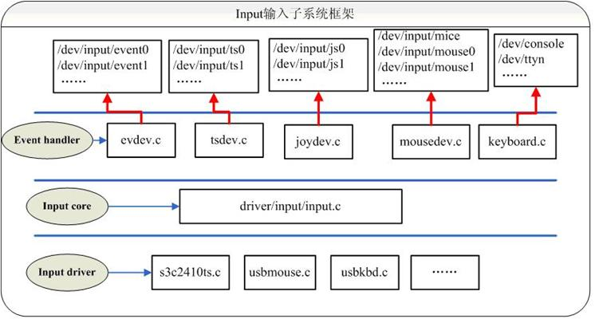
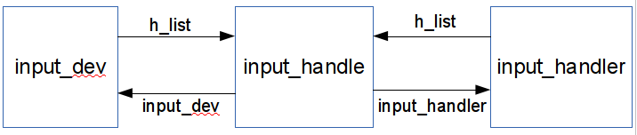

---
categories:
- learning
date: 2013-11-12T10:00:00
tags:
- linux
- kernel
- driver
title: Linux input subsystem
---

## 简介

本文接着[上一篇文章]() 讲述linux中的输入子系统, Input subsystem 旨在统一各式各样的输入设备,
起着承上启下的作用,对底层设备驱动层和上层用户层提供统一的访问借口,
下面来看下整体的框架:



这里包括3个抽象层:

- 设备驱动层: 用来产生各种类型的输入事件
- 输入子系统: 转发相应的输入事件给感兴趣的接收程序
- 事件处理层: 对收到的事件进行处理,例如转发给用户态程序,或者转发给其他接受模块

设备驱动层在[上一篇文章](已经讲过了,
这里采用从下到上的方式,主要分析后面两层.

## 输入子系统

这一层主要是起到衔接的作用,用于建立事件发送方(硬件输入设备)和事件接收方的关系,这个关系是n-m的关系,所以这里有3个主要的数据结构用于软件抽象:

- `input_dev`: 抽象输入事件的生产者
- `input_handle`: 抽象多对多的关系
- `input_handler`: 抽象事件的消费者(接收者)

三者之间相互联系,从而建立起整个子系统:



### input_dev

```
struct input_dev {
	const char *name; // 设备的名称
	const char *phys; // 节点设备在系统中的文件路径
	const char *uniq; // 设备的标识符(可选)
	struct input_id id; // 设备ID,包含总线ID(PCI,USB),厂商ID,与input_handler匹配的时会用到

	unsigned long propbit[BITS_TO_LONGS(INPUT_PROP_CNT)]; // 设备支持的特性

	unsigned long evbit[BITS_TO_LONGS(EV_CNT)]; // 设备支持的事件类型
	unsigned long keybit[BITS_TO_LONGS(KEY_CNT)]; // 设备支持的按键
	unsigned long relbit[BITS_TO_LONGS(REL_CNT)]; // 设备支持的相对位置事件的子类型
	unsigned long absbit[BITS_TO_LONGS(ABS_CNT)]; // 设备支持的绝对位置事件的子类型
	unsigned long mscbit[BITS_TO_LONGS(MSC_CNT)]; // 设备支持的其他事件的子类型
	unsigned long ledbit[BITS_TO_LONGS(LED_CNT)]; // 设备支持的led的状态
	unsigned long sndbit[BITS_TO_LONGS(SND_CNT)]; // 设备支持的声效
	unsigned long ffbit[BITS_TO_LONGS(FF_CNT)]; // 设备支持的力反馈
	unsigned long swbit[BITS_TO_LONGS(SW_CNT)]; // 设备支持的开关

	unsigned int hint_events_per_packet; //一个包(相邻的EV_SYN之间)包含的事件的平均数量, 主要用于接收者预估用于接收事件的buffer的大小

	unsigned int keycodemax; // keycode表的大小
	unsigned int keycodesize; // keycode表中元素的大小
	void *keycode; // 键盘映射表

	int (*setkeycode)(struct input_dev *dev,
			  const struct input_keymap_entry *ke,
			  unsigned int *old_keycode); // 可选的修改当前keymap的方法
	int (*getkeycode)(struct input_dev *dev,
			  struct input_keymap_entry *ke); // 可选的获得当前keymap的方法

	struct ff_device *ff; // 力反馈结构体(可选)

	unsigned int repeat_key; // 保存上一次按键的值,用于时间软件自动重复按键
	struct timer_list timer; // 用于软件重按键的定时器

	int rep[REP_CNT]; // 当前的软重按键的延迟和频率

	struct input_mt_slot *mt; // 多点触碰结构体数组
	int mtsize; // 数组元素的个数
	int slot; // 当前传输的slot号
	int trkid; // 储存的跟踪id

	struct input_absinfo *absinfo; // 记录相关坐标信息(当前值,最小值,最大值等等)

	unsigned long key[BITS_TO_LONGS(KEY_CNT)]; // 当前按键的状态
	unsigned long led[BITS_TO_LONGS(LED_CNT)]; // 当前led的状态
	unsigned long snd[BITS_TO_LONGS(SND_CNT)]; // 当前声效的状态
	unsigned long sw[BITS_TO_LONGS(SW_CNT)]; // 当前开关的状态

	int (*open)(struct input_dev *dev); // 当设备第一次打开时的回调函数,主要做一些准备工作(开启轮询线程,申请中断等等)
	void (*close)(struct input_dev *dev); // 当设备关闭时的回调函数
	int (*flush)(struct input_dev *dev, struct file *file); // 刷新设备
	int (*event)(struct input_dev *dev, unsigned int type, unsigned int code, int value); // 设备接收事件的回调函数(例如打开led,播放声音等等)

	struct input_handle __rcu *grab; // 设备当前关联的handle

	spinlock_t event_lock; // 当设备接收或处理事件时的自旋锁
	struct mutex mutex; // 用于顺序化open,close和flush操作

	unsigned int users; // 当前使用该设备的用户的数量
	bool going_away; // 用于标记当前设备正处于unregister过程

	bool sync; // 当设备自从上一次EV_SYN之后还没新的事件产生,则为true

	struct device dev; // 设备驱动模型相关

	struct list_head	h_list; // 关联的handle的列表
	struct list_head	node; // 当前设备在input_dev_list链表中的位置
};
```

### input_handle

```
struct input_handle {

	void *private; // handler特有的参数

	int open; // handle打开的数量
	const char *name; // 由创建它的handler起的名字

	struct input_dev *dev; // 关联的设备
	struct input_handler *handler; // 关联的handler

	struct list_head	d_node; // 在设备的list中的位置
	struct list_head	h_node; // 在handler的list的位置
};
```

### input_handler

```
struct input_handler {

	void *private; // 驱动特有的参数

	void (*event)(struct input_handle *handle, unsigned int type, unsigned int code, int value); // 事件处理函数
	bool (*filter)(struct input_handle *handle, unsigned int type, unsigned int code, int value); // 事件过滤函数
	bool (*match)(struct input_handler *handler, struct input_dev *dev); // 当匹配过设备的id和handler的id_table之后,进行更细的匹配
	int (*connect)(struct input_handler *handler, struct input_dev *dev, const struct input_device_id *id); // 当handler和设备建立关联时的回调函数
	void (*disconnect)(struct input_handle *handle); // 取出关联时的回调函数
	void (*start)(struct input_handle *handle); // 当建立过关系之后,首次开启handler的函数

	const struct file_operations *fops; // 设备文件的操作集
	int minor; // 次设备号(从32开始)
	const char *name; // handler的名字(/proc/bus/input/handlers)

	const struct input_device_id *id_table; // 该handler支持的设备的id

	struct list_head	h_list; // 指向关联的handle的列表
	struct list_head	node; // 在input_handler_list中的位置
};
```

### 事件传递

下面我们通过一个实例来了解事件是如何传递的,这里就拿[上一篇文章]()中,
当在触摸屏上按下时,产生的事件来说.

首先是设备驱动层向输入子系统报告按键事件: `input_report_key(ts.input,`BTN_TOUCH,`1)`

```
static inline void input_report_key(struct input_dev *dev, unsigned int code, int value)
{
	input_event(dev, EV_KEY, code, !!value);
}
```

```
void input_event(struct input_dev *dev,
		 unsigned int type, unsigned int code, int value)
```

其中,各个参数的值如下:

- `dev:` 当前touch screen设备
- `type:` `EV_KEY`
- `code:` `BTN_TOUCH`
- `value:` 1,表示按下

接着获得 `input_dev->event_lock` 锁,进入 `input_handle_event`:

```
case EV_KEY:
	if (is_event_supported(code, dev->keybit, KEY_MAX) &&
	    !!test_bit(code, dev->key) != value) {

		if (value != 2) {
			__change_bit(code, dev->key);
			if (value)
				input_start_autorepeat(dev, code);
			else
				input_stop_autorepeat(dev);
		}

		disposition = INPUT_PASS_TO_HANDLERS;
	}
	break;
```

这里,如果设备支持自动重按的功能,会开始一个周期性的timer,进行软件自动重发.
我们这里不考虑这种情况,接着往下看.

最终该事件是需要传递给相应的handler:

```
if (disposition & INPUT_PASS_TO_HANDLERS)
	input_pass_event(dev, type, code, value);
```

```
handle = rcu_dereference(dev->grab);
if (handle)
	handle->handler->event(handle, type, code, value);
else {
	bool filtered = false;

	list_for_each_entry_rcu(handle, &dev->h_list, d_node) {
		if (!handle->open)
			continue;

		handler = handle->handler;
		if (!handler->filter) {
			if (filtered)
				break;

			handler->event(handle, type, code, value);

		} else if (handler->filter(handle, type, code, value))
			filtered = true;
	}
}
```

这里,如果该handle有指定的handler已绑定,则将事件交给其处理,
否则,遍历所有的关联的handler,将事件交给每个满足条件的handler进行处理.
队列的开头会有一些过滤器,接着才是一些真正用于处理事件的handler.

这样,相应的事件就被传递给了相关联的handler了.

### 事件接收

在系统初始化的过程中,可能会有各式各样的事件处理handler注册,
这里选择一个通用的handler进行分析: `evdev` .
该handler会接收所有的事件,并提供给用户态获取.

首先是向输入子系统注册该handler:

```
static struct input_handler evdev_handler = {
	.event		= evdev_event,
	.connect	= evdev_connect,
	.disconnect	= evdev_disconnect,
	.fops		= &evdev_fops,
	.minor		= EVDEV_MINOR_BASE,
	.name		= "evdev",
	.id_table	= evdev_ids,
};

static int __init evdev_init(void)
{
	return input_register_handler(&evdev_handler);
}
```

之前说过,有些handler只是充当过滤器的作用,
所以用来区分两者的,是通过 `input_handler->fops` ,
如果为空,则该handler是一个过滤器,反之,则是一个真实的事件处理handler.
对于真实的handler会将放入 `input_table` 中,

```
if (handler->fops != NULL) {
	if (input_table[handler->minor >> 5]) {
		retval = -EBUSY;
		goto out;
	}
	input_table[handler->minor >> 5] = handler;
}
```

而所有类型的handler都会挂入 `input_handler_list` 中,

```
list_add_tail(&handler->node, &input_handler_list);
```

最后,遍历所有注册的输入设备,对那些该handler支持的设备建立关系.

```
list_for_each_entry(dev, &input_dev_list, node)
	input_attach_handler(dev, handler);
```

```
static int input_attach_handler(struct input_dev *dev, struct input_handler *handler)
{
	const struct input_device_id *id;
	int error;

	id = input_match_device(handler, dev);
	if (!id)
		return -ENODEV;

	error = handler->connect(handler, dev, id);
```

这里 `evdev_handler` ,会和所有的设备建立关系,关系建立的过程在
`input_handler->connect` 函数中.

之前说过,这里的关系是多对多的关系,是由 `input_handle` 来表示,
所以在connect函数中,一定会注册一个handle

```
evdev->handle.dev = input_get_device(dev);
evdev->handle.name = dev_name(&evdev->dev);
evdev->handle.handler = handler;
evdev->handle.private = evdev;
```

```
error = input_register_handle(&evdev->handle);
if (error)
	goto err_free_evdev;
```

在 `input_register_handle` 中,便是将handle分别挂入 `input_dev`
和 `input_handler` 的列表中.
这里唯一需要注意的是,如果handler是一个过滤器,则挂到设备的列表的开头,
反之,则挂入列表的结尾.

```
if (handler->filter)
	list_add_rcu(&handle->d_node, &dev->h_list);
else
	list_add_tail_rcu(&handle->d_node, &dev->h_list);
```

那么用户态程序是如何获得输入事件的呢,这里是通过访问设备文件节点来实现的
(/dev/input/evdevX).

每当一个用户态程序打开该文件,对于 `evdev` 来说都是一个 `client`:

```
struct evdev_client {
	unsigned int head; // 下一次写入的位置
	unsigned int tail; // 下一次读取的位置
	unsigned int packet_head; // 如果一个数据包,包含多个event,则指向第一个event的位置
	spinlock_t buffer_lock; /* protects access to buffer, head and tail */
	struct wake_lock wake_lock;
	bool use_wake_lock;
	char name[28];
	struct fasync_struct *fasync;
	struct evdev *evdev;
	struct list_head node;
	int clkid;
	unsigned int bufsize;
	struct input_event buffer[];
};
```

所以在设备文件的open函数中,主要就是初始化一个 `evdev_client`:

```
client = kzalloc(sizeof(struct evdev_client) +
			bufsize * sizeof(struct input_event),
		 GFP_KERNEL);
if (!client) {
	error = -ENOMEM;
	goto err_put_evdev;
}

client->bufsize = bufsize;
spin_lock_init(&client->buffer_lock);
snprintf(client->name, sizeof(client->name), "%s-%d",
		dev_name(&evdev->dev), task_tgid_vnr(current));
client->evdev = evdev;
evdev_attach_client(evdev, client);
```

这里用于存放事件的buffer是一个ring, 事件的格式如下:

```
struct input_event {
	struct timeval time;
	__u16 type;
	__u16 code;
	__s32 value;
};
```

当收到一个事件时,便将其放入该buffer中:

```
client->buffer[client->head++] = *event;
client->head &= client->bufsize - 1;
```

这里有两个特殊情况需要考虑,当buffer中没有剩余的空间,
则只会保留最近的一次event,同时在它之前添加一个特殊的事件,
用于标识之前的事件被丢弃了.

```
if (unlikely(client->head == client->tail)) {
	/*
	 * This effectively "drops" all unconsumed events, leaving
	 * EV_SYN/SYN_DROPPED plus the newest event in the queue.
	 */
	client->tail = (client->head - 2) & (client->bufsize - 1);

	client->buffer[client->tail].time = event->time;
	client->buffer[client->tail].type = EV_SYN;
	client->buffer[client->tail].code = SYN_DROPPED;
	client->buffer[client->tail].value = 0;

	client->packet_head = client->tail;
	if (client->use_wake_lock)
		wake_unlock(&client->wake_lock);
}
```

还有一种情况就是收到一个 `EV_SYN` 事件,这样将 `packet_head` 指向
即将写入的事件的位置.

```
if (event->type == EV_SYN && event->code == SYN_REPORT) {
	client->packet_head = client->head;
	if (client->use_wake_lock)
		wake_lock(&client->wake_lock);
	kill_fasync(&client->fasync, SIGIO, POLL_IN);
}
```

这里同样提供用户态程序向kernel写事件的方法,
逻辑和从buffer中取事件正相反.

当然用户态程序也可以使用论询或异步通知的机制来读取事件.
具体见 `poll` 和 `fasync` 方法.

```
static const struct file_operations evdev_fops = {
	.owner		= THIS_MODULE,
	.read		= evdev_read,
	.write		= evdev_write,
	.poll		= evdev_poll,
	.open		= evdev_open,
	.release	= evdev_release,
	.unlocked_ioctl	= evdev_ioctl,
#ifdef CONFIG_COMPAT
	.compat_ioctl	= evdev_ioctl_compat,
#endif
	.fasync		= evdev_fasync,
	.flush		= evdev_flush,
	.llseek		= no_llseek,
};
```

FIN.
