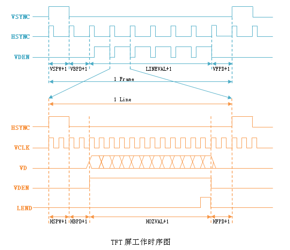
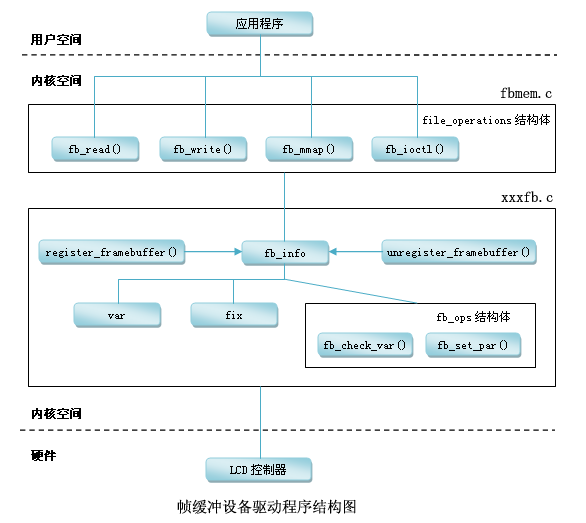

---
categories:
- learning
date: 2013-11-08T14:33:00
tags:
- linux
- kernel
- driver
title: Linux LCD driver
---

## 简介

这篇文章主要分析linux中的lcd驱动,在linux一个lcd显示屏被抽象成 帧缓冲(`framebuffer`) 的概念.

在开始之前,首先说下lcd tft屏的成像原理.

### 时序



#### 像素

这里假设一个像素点由16bit组成:

-  VD[23:19],VD[15:10],VD[7:3]:  分别对应R,G,B分色信息,一个16bit的组合代表了一个象素的信息
-  VDEN:  数据使能信号
-  VCLK:  显示指针从矩形左上角的第一行第一个点开始,一个点一个点的在LCD上显示,在上面的时序图上用时间线表示就为VCLK,我们称之为像素时钟信号

#### 行

显示指针在从一行的右边回到下一行的左边是需要一定的时间的,我们称之为行切换,
理想情况下,两行之间不需要间隔,也就是说这一行结束马上传输下一行的第一个pixel的VD.
但是这样做并不好,因为一个点的偏差会造成满盘皆输.因此我们引入了行同步HSYNC信号,也就是说在传输完一行的数据后,先歇一会儿,等待若干个
时钟(我们称之为后插入等待周期HFPD);然后我们送一个行同步信号,当然这个信号的有效周期数我们也能控制(我们称之为同步周期HSPW);之后呢,我们在等一会,让
LCD驱动电路准备好接收,我们在把一行的数据发下去(这个等待时间我们称之为前插入等待周期HBPD)

-  HSYNC:  当显示指针一直显示到矩形的右边就结束这一行,那么这一行的动作在上面的时序图中就称之为1 Line,如此类推,显示指针就这样一行一行的显示至矩形的右下角才把一副图显示完成.因此,这一行一行的显示在时间线上看,就是时序图上的HSYNC,表示新的一行即将开始
-  HSPW(horizontal sync pulse width): 表示水平同步信号的宽度,用VCLK计算
-  HBPD(horizontal back porch):  表示从水平同步信号开始到一行的有效数据开始之间的VCLK的个数
-  HFPD(horizontal front porth):  表示一行的有效数据结束到下一个水平同步信号开始之间的VCLK的个数

#### 帧

同理,帧同步的原理和行同步一样,也存在3个周期:

-  VSYNC:  然而,LCD的显示并不是对一副图像快速的显示一下,为了持续和稳定的在LCD上显示,就需要切换到另一幅图上(另一幅图可以和上一副图一样或者不一样,目的只是为了将图像持续的显示在LCD上).那么这一副一副的图像就称之为帧,在时序图上就表示为1 Frame,因此从时序图上可以看出1 Line只是1 Frame中的一行;同样的,在帧与帧切换之间也是需要一定的时间的,我们称之为帧切换,那么LCD整个显示的过程在时间线上看,就可表示为时序图上的VSYNC,表示新的一帧即将开始
-  VBPD(vertical back porch):  表示在一帧图像开始时,垂直同步信号以后的无效的行数
-  VFBD(vertical front porch):  表示在一帧图像结束后,垂直同步信号以前的无效的行数
-  VSPW(vertical sync pulse width):  表示垂直同步脉冲的宽度,用行数计算

### 帧缓冲(framebuffer)

了解了lcd的成像基本原理和时序,下面我们结合具体代码,来看下具体是如何完成这些操作的.

首先来看下帧缓冲设备驱动在Linux子系统中的结构:



我们从上面这幅图看,帧缓冲设备在Linux中也可以看做是一个完整的子系统,
大体由fbmem.c和xxxfb.c组成.向上给应用程序提供完善的设备文件操作接口(即对FrameBuffer设备进行read、write、ioctl等操作),
接口在Linux提供的fbmem.c文件中实现;向下提供了硬件操作的接口,只是这些接口Linux并没有提供实现,因为这要根据具体的LCD控制器硬件进行设置,
所以这就是我们要做的事情了(即xxxfb.c部分的实现)

#### 重要数据结构

##### fb_info

最主要的数据结构为 `fb_info` ,
其中包括了帧缓冲设备的全部信息,包括设备的设置参数,
状态以及对底层硬件操作的函数指针.

```
struct fb_info {
	atomic_t count;
	int node;
	int flags;
	struct mutex lock;		/* Lock for open/release/ioctl funcs */
	struct mutex mm_lock;		/* Lock for fb_mmap and smem_* fields */
	struct fb_var_screeninfo var;	/* Current var */
	struct fb_fix_screeninfo fix;	/* Current fix */
	struct fb_monspecs monspecs;	/* Current Monitor specs */
	struct work_struct queue;	/* Framebuffer event queue */
	struct fb_pixmap pixmap;	/* Image hardware mapper */
	struct fb_pixmap sprite;	/* Cursor hardware mapper */
	struct fb_cmap cmap;		/* Current cmap */
	struct list_head modelist;      /* mode list */
	struct fb_videomode *mode;	/* current mode */

#ifdef CONFIG_FB_BACKLIGHT
	/* assigned backlight device */
	/* set before framebuffer registration, 
	   remove after unregister */
	struct backlight_device *bl_dev;

	/* Backlight level curve */
	struct mutex bl_curve_mutex;	
	u8 bl_curve[FB_BACKLIGHT_LEVELS];
#endif
#ifdef CONFIG_FB_DEFERRED_IO
	struct delayed_work deferred_work;
	struct fb_deferred_io *fbdefio;
#endif

	struct fb_ops *fbops;
	struct device *device;		/* This is the parent */
	struct device *dev;		/* This is this fb device */
	int class_flag;                    /* private sysfs flags */
#ifdef CONFIG_FB_TILEBLITTING
	struct fb_tile_ops *tileops;    /* Tile Blitting */
#endif
	char __iomem *screen_base;	/* Virtual address */
	unsigned long screen_size;	/* Amount of ioremapped VRAM or 0 */ 
	void *pseudo_palette;		/* Fake palette of 16 colors */ 
#define FBINFO_STATE_RUNNING	0
#define FBINFO_STATE_SUSPENDED	1
	u32 state;			/* Hardware state i.e suspend */
	void *fbcon_par;                /* fbcon use-only private area */
	/* From here on everything is device dependent */
	void *par;
	/* we need the PCI or similar aperture base/size not
	   smem_start/size as smem_start may just be an object
	   allocated inside the aperture so may not actually overlap */
	struct apertures_struct {
		unsigned int count;
		struct aperture {
			resource_size_t base;
			resource_size_t size;
		} ranges[0];
	} *apertures;
};
```

其中,比较重要的成员有 `struct fb_var_screeninfo var` ,
`struct fb_fix_screeninfo fix` 和`struct fb_ops *fbops` ,他们也都是结构体

##### fb_var_screeninfo

`fb_var_screeninfo` 结构体主要记录用户可以修改的控制器的参数,比如屏幕的分辨率和每个像素的比特数等,该结构体定义如下:

```
struct fb_var_screeninfo {
	__u32 xres;			/* visible resolution		*/
	__u32 yres;
	__u32 xres_virtual;		/* virtual resolution		*/
	__u32 yres_virtual;
	__u32 xoffset;			/* offset from virtual to visible */
	__u32 yoffset;			/* resolution			*/

	__u32 bits_per_pixel;		/* guess what			*/
	__u32 grayscale;		/* 0 = color, 1 = grayscale,	*/
					/* >1 = FOURCC			*/
	struct fb_bitfield red;		/* bitfield in fb mem if true color, */
	struct fb_bitfield green;	/* else only length is significant */
	struct fb_bitfield blue;
	struct fb_bitfield transp;	/* transparency			*/	

	__u32 nonstd;			/* != 0 Non standard pixel format */

	__u32 activate;			/* see FB_ACTIVATE_*		*/

	__u32 height;			/* height of picture in mm    */
	__u32 width;			/* width of picture in mm     */

	__u32 accel_flags;		/* (OBSOLETE) see fb_info.flags */

	/* Timing: All values in pixclocks, except pixclock (of course) */
	__u32 pixclock;			/* pixel clock in ps (pico seconds) */
	__u32 left_margin;		/* time from sync to picture	*/
	__u32 right_margin;		/* time from picture to sync	*/
	__u32 upper_margin;		/* time from sync to picture	*/
	__u32 lower_margin;
	__u32 hsync_len;		/* length of horizontal sync	*/
	__u32 vsync_len;		/* length of vertical sync	*/
	__u32 sync;			/* see FB_SYNC_*		*/
	__u32 vmode;			/* see FB_VMODE_*		*/
	__u32 rotate;			/* angle we rotate counter clockwise */
	__u32 colorspace;		/* colorspace for FOURCC-based modes */
	__u32 reserved[4];		/* Reserved for future compatibility */
};
```

##### fb_fix_screeninfo

而 `fb_fix_screeninfo` 结构体又主要记录用户不可以修改的控制器的参数,
比如屏幕缓冲区的物理地址和长度等,该结构体的定义如下:

```
struct fb_fix_screeninfo {
	char id[16];			/* identification string eg "TT Builtin" */
	unsigned long smem_start;	/* Start of frame buffer mem */
					/* (physical address) */
	__u32 smem_len;			/* Length of frame buffer mem */
	__u32 type;			/* see FB_TYPE_*		*/
	__u32 type_aux;			/* Interleave for interleaved Planes */
	__u32 visual;			/* see FB_VISUAL_*		*/ 
	__u16 xpanstep;			/* zero if no hardware panning  */
	__u16 ypanstep;			/* zero if no hardware panning  */
	__u16 ywrapstep;		/* zero if no hardware ywrap    */
	__u32 line_length;		/* length of a line in bytes    */
	unsigned long mmio_start;	/* Start of Memory Mapped I/O   */
					/* (physical address) */
	__u32 mmio_len;			/* Length of Memory Mapped I/O  */
	__u32 accel;			/* Indicate to driver which	*/
					/*  specific chip/card we have	*/
	__u16 capabilities;		/* see FB_CAP_*			*/
	__u16 reserved[2];		/* Reserved for future compatibility */
};
```

##### fb_ops

`fb_ops` 结构体是对底层硬件操作的函数指针,该结构体中定义了对硬件的操作有:

```
struct fb_ops {
	/* open/release and usage marking */
	struct module *owner;
	int (*fb_open)(struct fb_info *info, int user);
	int (*fb_release)(struct fb_info *info, int user);

	/* For framebuffers with strange non linear layouts or that do not
	 * work with normal memory mapped access
	 */
	ssize_t (*fb_read)(struct fb_info *info, char __user *buf,
			   size_t count, loff_t *ppos);
	ssize_t (*fb_write)(struct fb_info *info, const char __user *buf,
			    size_t count, loff_t *ppos);

	/* checks var and eventually tweaks it to something supported,
	 * DO NOT MODIFY PAR */
	int (*fb_check_var)(struct fb_var_screeninfo *var, struct fb_info *info);

	/* set the video mode according to info->var */
	int (*fb_set_par)(struct fb_info *info);

	/* set color register */
	int (*fb_setcolreg)(unsigned regno, unsigned red, unsigned green,
			    unsigned blue, unsigned transp, struct fb_info *info);

	/* set color registers in batch */
	int (*fb_setcmap)(struct fb_cmap *cmap, struct fb_info *info);

	/* blank display */
	int (*fb_blank)(int blank, struct fb_info *info);

	/* pan display */
	int (*fb_pan_display)(struct fb_var_screeninfo *var, struct fb_info *info);

	/* Draws a rectangle */
	void (*fb_fillrect) (struct fb_info *info, const struct fb_fillrect *rect);
	/* Copy data from area to another */
	void (*fb_copyarea) (struct fb_info *info, const struct fb_copyarea *region);
	/* Draws a image to the display */
	void (*fb_imageblit) (struct fb_info *info, const struct fb_image *image);

	/* Draws cursor */
	int (*fb_cursor) (struct fb_info *info, struct fb_cursor *cursor);

	/* Rotates the display */
	void (*fb_rotate)(struct fb_info *info, int angle);

	/* wait for blit idle, optional */
	int (*fb_sync)(struct fb_info *info);

	/* perform fb specific ioctl (optional) */
	int (*fb_ioctl)(struct fb_info *info, unsigned int cmd,
			unsigned long arg);

	/* Handle 32bit compat ioctl (optional) */
	int (*fb_compat_ioctl)(struct fb_info *info, unsigned cmd,
			unsigned long arg);

	/* perform fb specific mmap */
	int (*fb_mmap)(struct fb_info *info, struct vm_area_struct *vma);

	/* get capability given var */
	void (*fb_get_caps)(struct fb_info *info, struct fb_blit_caps *caps,
			    struct fb_var_screeninfo *var);

	/* teardown any resources to do with this framebuffer */
	void (*fb_destroy)(struct fb_info *info);

	/* called at KDB enter and leave time to prepare the console */
	int (*fb_debug_enter)(struct fb_info *info);
	int (*fb_debug_leave)(struct fb_info *info);
};
```

#### 设备初始化

下面来看下当驱动模块加载时对设备初始化的过程,
这里拿s3c2410的lcd驱动代码作为例子,
设备初始化的代码在驱动的 `probe` 函数中.

```
static struct platform_driver s3c2410fb_driver = {
	.probe		= s3c2410fb_probe,
	.remove		= __devexit_p(s3c2410fb_remove),
	.suspend	= s3c2410fb_suspend,
	.resume		= s3c2410fb_resume,
	.driver		= {
		.name	= "s3c2410-lcd",
		.owner	= THIS_MODULE,
	},
};
```

首先看下这个回调函数的参数

```
static int __devinit s3c24xxfb_probe(struct platform_device *pdev,
				  enum s3c_drv_type drv_type)
```

一个指向 `platform_device` 的指针,想必是只想该驱动支持的设备的指针,
这部分工作是由 `platform_bus`
这条虚拟总线子系统去完成的,这部分内容不在此分析,
我们可以先这么认为:
在系统初始化的过程中,当探测到相应的设备,便会虚拟出一个 `platform_device`
并将其注册.
那么,我们来看看系统注册了那些可能的s3c2410的lcd设备.
在arch/arm/plat-samsung/devs.c中:

```
static struct resource s3c_lcd_resource[] = {
	[0] = DEFINE_RES_MEM(S3C24XX_PA_LCD, S3C24XX_SZ_LCD),
	[1] = DEFINE_RES_IRQ(IRQ_LCD),
};

struct platform_device s3c_device_lcd = {
	.name		= "s3c2410-lcd",
	.id		= -1,
	.num_resources	= ARRAY_SIZE(s3c_lcd_resource),
	.resource	= s3c_lcd_resource,
	.dev		= {
		.dma_mask		= &samsung_device_dma_mask,
		.coherent_dma_mask	= DMA_BIT_MASK(32),
	}
};
```

这里主要预定义了访问设备的io地址和所用的中断号.
当然,对于lcd设备,还有一些特有的设置信息,例如屏幕有多大,分辨率是多少等等.
这些信息在arch/arm/mach-s3c24xx/mach-smdk2440.c:

```
static struct s3c2410fb_display smdk2440_lcd_cfg __initdata = {

	.lcdcon5	= S3C2410_LCDCON5_FRM565 |
			  S3C2410_LCDCON5_INVVLINE |
			  S3C2410_LCDCON5_INVVFRAME |
			  S3C2410_LCDCON5_PWREN |
			  S3C2410_LCDCON5_HWSWP,

	.type		= S3C2410_LCDCON1_TFT,

	.width		= 240,
	.height		= 320,

	.pixclock	= 166667, /* HCLK 60 MHz, divisor 10 */
	.xres		= 240,
	.yres		= 320,
	.bpp		= 16,
	.left_margin	= 20,
	.right_margin	= 8,
	.hsync_len	= 4,
	.upper_margin	= 8,
	.lower_margin	= 7,
	.vsync_len	= 4,
};

static struct s3c2410fb_mach_info smdk2440_fb_info __initdata = {
	.displays	= &smdk2440_lcd_cfg,
	.num_displays	= 1,
	.default_display = 0,

	/* currently setup by downloader */
	.gpccon		= 0xaa940659,
	.gpccon_mask	= 0xffffffff,
	.gpcup		= 0x0000ffff,
	.gpcup_mask	= 0xffffffff,
	.gpdcon		= 0xaa84aaa0,
	.gpdcon_mask	= 0xffffffff,
	.gpdup		= 0x0000faff,
	.gpdup_mask	= 0xffffffff,

	.lpcsel		= ((0xCE6) & ~7) | 1<<4,
};
```

这样就既有操作系统相关的设置(io地址,中断号),
又有具体硬件平台相关的设置(分辨率,屏幕大小等等).
当然,平台相关信息是存放在 `platform_device->dev.platform_data` 中.

所以 `probe` 回调函数就可以根据预定义的设置进行初始化,
初始化的过程包括io地址空间的申请:

```
res = platform_get_resource(pdev, IORESOURCE_MEM, 0);
if (res == NULL) {
	dev_err(&pdev->dev, "failed to get memory registers\n");
	ret = -ENXIO;
	goto dealloc_fb;
}

size = resource_size(res);
info->mem = request_mem_region(res->start, size, pdev->name);
if (info->mem == NULL) {
	dev_err(&pdev->dev, "failed to get memory region\n");
	ret = -ENOENT;
	goto dealloc_fb;
}

info->io = ioremap(res->start, size);
if (info->io == NULL) {
	dev_err(&pdev->dev, "ioremap() of registers failed\n");
	ret = -ENXIO;
	goto release_mem;
}
```

中断初始化:

```
ret = request_irq(irq, s3c2410fb_irq, 0, pdev->name, info);
if (ret) {
	dev_err(&pdev->dev, "cannot get irq %d - err %d\n", irq, ret);
	ret = -EBUSY;
	goto release_regs;
}
```

申请帧缓冲区dma内存:

```
/* Initialize video memory */
ret = s3c2410fb_map_video_memory(fbinfo);
if (ret) {
	printk(KERN_ERR "Failed to allocate video RAM: %d\n", ret);
	ret = -ENOMEM;
	goto release_clock;
}
```

如果申请成功,那么 `fb_info->screen_base` 指向该段内存的起始虚拟地址,
`fb_info->fix.smem_start` 则指向该段内存的起始物理地址.

最终注册初始化好的 `framebuffer` :

```
ret = register_framebuffer(fbinfo);
if (ret < 0) {
	printk(KERN_ERR "Failed to register framebuffer device: %d\n",
		ret);
	goto free_cpufreq;
}
```

### 调色板

在计算机图像技术中,一个像素的颜色是由它的R,G,B分量表示的,
每个分量又经过量化,一个像素总的量化级数就是这个显示系统的颜色深度.
量化级数越高,可以表示的颜色也就越多,最终的图像也就越逼真.
当量化级数达到16位以上时,被称为真彩色.但是,量化级数越高,就需要越高的数据宽度,
给处理器带来的负担也就越重;量化级数在8位以下时,所能表达的颜色又太少,不能够满足用户特定的需求.

为了解决这个问题,可以采取调色板技术.
所谓调色板,就是在低颜色深度的模式下,在有限的像素值与RGB颜色之间建立对应关系的一个线性表.
以256色调色板为例,调色板中存储256种颜色的RGB值,每种颜色的RGB值是16位.
用这256种颜色编制索引时,从00H~FFH只需要8位数据宽度,而每个索引所对应的颜色却是16位宽度的颜色信息.

下面来看下调色板相关的代码.
首先是在 `probe` 中对调色板的初始化:

```
for (i = 0; i < 256; i++)
	info->palette_buffer[i] = PALETTE_BUFF_CLEAR;
```

设置调色板中的颜色是通过 `fp_ops.fb_setcolreg` 完成的.
在分析这个函数之前,有个概念必须先了解:

根据每个像素点bit位数(bpp)的不同,分为3种模式,
各个模式使用的调色板是不同的:

- 真彩色: bpp>=12, 使用软件调色板
- 单色: bpp==1, 不使用调色板
- 伪彩色: 1<bpp<12, 使用硬件调色板

硬件调色板和软件调色板,从字面上就可以猜出他们的区别,
当然他们分别对应 `fb_info` 结构中的2个字段:

- 硬件调色板 <-> `fb_info->palette_buffer`
- 软件调色板 <-> `fb_info->pseudo_palatte`

下面我们可以来看 `fb_setcolreg` 了,
这个函数的逻辑很简单,对于不同的模式,填充不同的调色板,
首先是真彩色模式:

```
case FB_VISUAL_TRUECOLOR:
	/* true-colour, use pseudo-palette */

	if (regno < 16) {
		u32 *pal = info->pseudo_palette;

		val  = chan_to_field(red,   &info->var.red);
		val |= chan_to_field(green, &info->var.green);
		val |= chan_to_field(blue,  &info->var.blue);

		pal[regno] = val;
	}
	break;
```

接着是伪彩色模式:

```
case FB_VISUAL_PSEUDOCOLOR:
	if (regno < 256) {
		/* currently assume RGB 5-6-5 mode */

		val  = (red   >>  0) & 0xf800;
		val |= (green >>  5) & 0x07e0;
		val |= (blue  >> 11) & 0x001f;

		writel(val, regs + S3C2410_TFTPAL(regno));
		schedule_palette_update(fbi, regno, val);
	}

	break;
```

其中, `schedule_palette_update` 是干什么的,这里有个优化,
对于调色板的更新,并不是每次更新一个,而是每次更新整个调色板,
而更新的时机便是在一次 `FRSYNC` 中断中,
所以这里只是将颜色的值先写入 `palette_buffer` 中,同时开启中断:

```
fbi->palette_buffer[regno] = val;

if (!fbi->palette_ready) {
	fbi->palette_ready = 1;

	/* enable IRQ */
	irqen = readl(irq_base + S3C24XX_LCDINTMSK);
	irqen &= ~S3C2410_LCDINT_FRSYNC;
	writel(irqen, irq_base + S3C24XX_LCDINTMSK);
}
```

再反观,中断回调函数, 如果调色需要更新,则更新整个调色板:

```
if (lcdirq & S3C2410_LCDINT_FRSYNC) {
	if (fbi->palette_ready)
		s3c2410fb_write_palette(fbi);

	writel(S3C2410_LCDINT_FRSYNC, irq_base + S3C24XX_LCDINTPND);
	writel(S3C2410_LCDINT_FRSYNC, irq_base + S3C24XX_LCDSRCPND);
}
```

### 其他

- `fb_ops->fb_check_var:` 主要是根据屏幕的分辨率( `xres`, `yres`) 和色宽( `bits_per_pixel` ), 获得相应屏幕的默认配置.
- `fb_ops->fb_set_par:` 使能相应的配置, 包括显示模式,行宽以及配置控制器寄存器组( `lcdcon1-5`, `lcdsaddr1-3`)
- `fb_ops->fb_blank:` 空屏
下面是一些操作和硬件设备没有依赖,所以使用了一系列通用的函数( `cfb_xxx` )

- `fb_ops->fb_fillrect:` 画一个单色矩形
- `fb_ops->fb_copyarea:` 复制一块区域
- `fb_ops->fb_imageblit:` 画一个画面

FIN.
