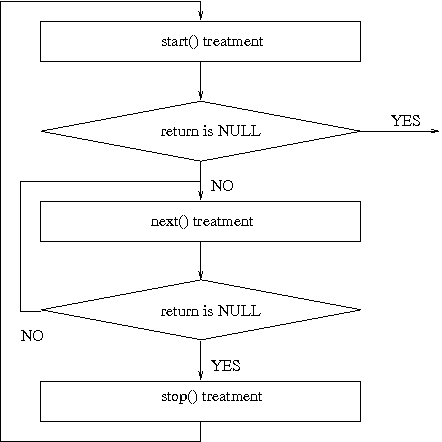
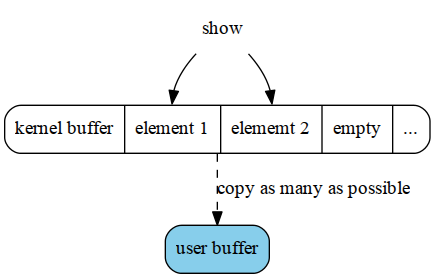
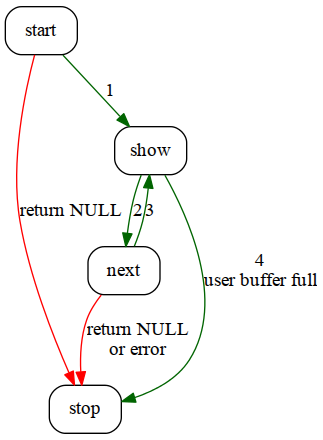

---
categories:
- learning
date: 2013-05-02T17:09:00
tags:
- kernel
title: Sequential file
---

今天在调试driver时，当查看一个proc文件时，碰到一个问题，
之后发现是因为现实内容查过了4Kb（也就是一个page的大小），
所以，理所当然使用的kernel提供的seq_file的方式，
不过，经过修改之后问题依旧，最后通过查看src，发现原来是自己对seq_file理解还不够深刻。

问题首先出现在网上找到的一片[关于seq_file使用的文章][1]，其中主要的逻辑图如下:

[1]: http://www.tldp.org/LDP/lkmpg/2.6/html/x861.html

这里，有几点没有涉及:

- 这里并没有说明show在哪里被调用。
- 如果内容大于一个page时，处理逻辑又是怎样的。

下面就结合代码(linux-2.6.32-220.el6)，一一解释。

## Essential

首先是关键的数据结构:

~~~
struct seq_file {
	char *buf;
	size_t size;
	size_t from;
	size_t count;
	loff_t index;
	loff_t read_pos;
	u64 version;
	struct mutex lock;
	const struct seq_operations *op;
	void *private;
};
~~~
- size： 申请的buf的大小。
- from： 实际内容在buf中offset。
- count: 实际内容的大小。
- read_pos: 当前在文件的offset。

其中buf初始大小为PAGE_SIZE

~~~
m->buf = kmalloc(m->size = PAGE_SIZE, GFP_KERNEL);
~~~

seq_operations定义如下:

~~~
struct seq_operations {
	void * (*start) (struct seq_file *m, loff_t *pos);
	void (*stop) (struct seq_file *m, void *v);
	void * (*next) (struct seq_file *m, void *v, loff_t *pos);
	int (*show) (struct seq_file *m, void *v);
};
~~~
- start: 开始迭代的callback，返回序列中第一个元素（user definition）
- stop: 暂停迭代的callback
- next: 返回序列中的下一个元素，如果没有则返回NULL
- show: 将元素写入写入到buf中

其中seq_file提供了show的方法，拿seq_printf为例：

~~~
int seq_printf(struct seq_file *m, const char *f, ...)
{
	va_list args;
	int len;

	if (m->count < m->size) {
		va_start(args, f);
		len = vsnprintf(m->buf + m->count, m->size - m->count, f, args);
		va_end(args);
		if (m->count + len < m->size) {
			m->count += len;
			return 0;
		}
	}
	m->count = m->size;
	return -1;
}
~~~
可以看出，如果buf中的内容超过buf的大小，则返回错误（-1）.

知道了这些，我们可以看下seq_read的逻辑。

## Normal case

首先看看一般正常情形下的处理逻辑：

1. start开始迭代
2. show将第一个元素写入buf
3. 如果buf为空，调用next返回下一个元素，返回步骤2
4. 如果buf不为空，且user buffer中还有空间，调用next返回下一个元素继续show。
知道buf满了为止。
5. 暂停迭代，调用stop callback。将buf中的内容copy到user buffer中，
更新count，from，read_pos

这里牵涉到2个buffer:

每次show只是将序列中的一个元素copy到kernel buffer中,
而一次seq_read会将kernel buffer中的内容copy到user buffer中。
这里为了提高性能，如果user buffer中空闲的大小大于kernel
buffer中内容的大小，会尽可能填充kernel buffer。

## Corner case

下面来看2个异常的case

- 如果一次show写入的内容超过buf size怎么办？
答案是重新申请一个更大的buf，再试一次。

~~~
...
m->op->stop(m, p);
kfree(m->buf);
m->buf = kmalloc(m->size <<= 1, GFP_KERNEL);
if (!m->buf)
	goto Enomem;
m->count = 0;
m->version = 0;
pos = m->index;
p = m->op->start(m, &pos);
...
~~~

- 由于seq_file支持seek，这就read offset就有可能会改变,
那么如果read offset和seq_file中记录的offset（即read_pos字段）不一致怎么办？
答案是从头开始，模拟一次读写过程，就好象之前已经读到该offset位置。

~~~
...
p = m->op->start(m, &index);
while (p) {
	error = PTR_ERR(p);
	if (IS_ERR(p))
		break;
	error = m->op->show(m, p);
	if (error < 0)
		break;
	if (unlikely(error)) {
		error = 0;
		m->count = 0;
	}
	if (m->count == m->size)
		goto Eoverflow;
	if (pos + m->count > offset) {
		m->from = offset - pos;
		m->count -= m->from;
		m->index = index;
		break;
	}
	pos += m->count;
	m->count = 0;
	if (pos == offset) {
		index++;
		m->index = index;
		break;
	}
	p = m->op->next(m, p, &index);
}
m->op->stop(m, p);
m->index = index;
...
~~~
其中offset为经过修改的read offset。

## Conclusion

进过上述的分析，给出一个经过修改的逻辑图：

其中红色为异常情况，绿色为一般正常流程，数字表示执行顺序。

FIN
