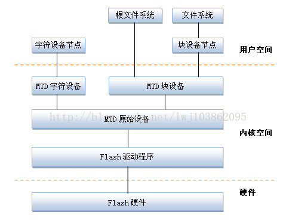

---
categories:
- learning
date: 2018-09-11T09:53:00
tags:
- flash
- linux
- kernel
title: MTD Subsystem
---

## introduction

MTD(Memory Technology Device)即内存技术设备,在Linux内核中,
引入MTD层为NOR FLASH和NAND FLASH设备提供统一接口.
MTD将文件系统与底层FLASH存储器进行了隔离.



其中 :

- Flash硬件驱动层 : Flash硬件驱动层负责对Flash硬件的读,写和擦除操作.MTD设备的Nand Flash芯片的驱动则drivers/mtd/nand/子目录下,Nor Flash芯片驱动位于drivers/mtd/chips/子目录下.
- MTD原始设备层 : 用于描述MTD原始设备的数据结构是mtd_info,它定义了大量的关于MTD的数据和操作函数.其中mtdcore.c MTD原始设备接口相关实现,mtdpart.c: MTD分区接口相关实现.
- MTD设备层: 基于MTD原始设备,linux系统可以定义出MTD的块设备(主设备号31)和字符设备(设备号90).其中mtdchar.c :  MTD字符设备接口相关实现,mtdblock.c : MTD块设备接口相关实现.

## Data Structure

### mtd_info

mtd_info用于抽象mtd原始设备 , 其定义如下 :

```
struct mtd_info {
	u_char type;	     /* MTD类型，包括MTD_NORFLASH,MTD_NANDFLASH等(可参考mtd-abi.h) */
	uint32_t flags;	     /* MTD属性标志，MTD_WRITEABLE,MTD_NO_ERASE等(可参考mtd-abi.h) */
	uint64_t size;	     /* mtd设备的大小 */
	uint32_t erasesize;	 /* MTD设备的擦除单元大小，对于NandFlash来说就是Block的大小 */
	uint32_t writesize;	 /* 写大小, 对于norFlash是字节,对nandFlash为一页 */
	uint32_t oobsize;    /* OOB字节数 */
	uint32_t oobavail;   /* 可用的OOB字节数 */
	unsigned int erasesize_shift;	/* 擦除单元大小的2进制偏移 */
	unsigned int writesize_shift;	/* 写大小的2进制偏移 */
	unsigned int erasesize_mask;	/* 擦除大小的mask */
	unsigned int writesize_mask;	/* 写大小的mask */
	const char *name;				/* 名字 */
	int index;						/* 索引号 */
	int numeraseregions;			/* 通常为1 */
	struct mtd_erase_region_info *eraseregions;	/* 可变擦除区域 */
	
	void *priv;		/* 设备私有数据指针，对于NandFlash来说指nand_chip结构体 */
	struct module *owner;	/* 一般设置为THIS_MODULE */
	
	/* 擦除函数 */
	int (*erase) (struct mtd_info *mtd, struct erase_info *instr);
 
	/* 读写flash函数 */
	int (*read) (struct mtd_info *mtd, loff_t from, size_t len, size_t *retlen, u_char *buf);
	int (*write) (struct mtd_info *mtd, loff_t to, size_t len, size_t *retlen, const u_char *buf);
 
	/* 带oob读写Flash函数 */
	int (*read_oob) (struct mtd_info *mtd, loff_t from,
			 struct mtd_oob_ops *ops);
	int (*write_oob) (struct mtd_info *mtd, loff_t to,
			 struct mtd_oob_ops *ops);
 
	int (*get_fact_prot_info) (struct mtd_info *mtd, struct otp_info *buf, size_t len);
	int (*read_fact_prot_reg) (struct mtd_info *mtd, loff_t from, size_t len, size_t *retlen, u_char *buf);
	int (*get_user_prot_info) (struct mtd_info *mtd, struct otp_info *buf, size_t len);
	int (*read_user_prot_reg) (struct mtd_info *mtd, loff_t from, size_t len, size_t *retlen, u_char *buf);
	int (*write_user_prot_reg) (struct mtd_info *mtd, loff_t from, size_t len, size_t *retlen, u_char *buf);
	int (*lock_user_prot_reg) (struct mtd_info *mtd, loff_t from, size_t len);
 
	int (*writev) (struct mtd_info *mtd, const struct kvec *vecs, unsigned long count, loff_t to, size_t *retlen);
	int (*panic_write) (struct mtd_info *mtd, loff_t to, size_t len, size_t *retlen, const u_char *buf);
	/* Sync */
	void (*sync) (struct mtd_info *mtd);
 
	/* Chip-supported device locking */
	int (*lock) (struct mtd_info *mtd, loff_t ofs, uint64_t len);
	int (*unlock) (struct mtd_info *mtd, loff_t ofs, uint64_t len);
 
	/* 电源管理函数 */
	int (*suspend) (struct mtd_info *mtd);
	void (*resume) (struct mtd_info *mtd);
 
	/* 坏块管理函数 */
	int (*block_isbad) (struct mtd_info *mtd, loff_t ofs);
	int (*block_markbad) (struct mtd_info *mtd, loff_t ofs);
 
	void (*unpoint) (struct mtd_info *mtd, loff_t from, size_t len);
	unsigned long (*get_unmapped_area) (struct mtd_info *mtd,
					    unsigned long len,
					    unsigned long offset,
					    unsigned long flags);
	struct backing_dev_info *backing_dev_info;
	struct notifier_block reboot_notifier;  /* default mode before reboot */
 
	/* ECC status information */
	struct mtd_ecc_stats ecc_stats;
	int subpage_sft;
	struct device dev;
	int usecount;
	int (*get_device) (struct mtd_info *mtd);
	void (*put_device) (struct mtd_info *mtd);
};
```

所有的mtd_info都通过 `add_mtd_device` 和 `del_mtd_device` 接口向系统添加和删除 . 
所有的mtd_info都通过 `index` 作为id在全局的 `mtd_idr` 中进行查找 . 

### mtd_part

如果一个mtd设备下挂载多个分区 , 每个分区由 `mtd_part` 进行抽象 , 其定义如下 :

```
struct mtd_partition {
	struct mtd_info mtd;
	struct mtd_info *master;
	uint64_t offset;
	struct list_head list;
};
```

其实每个分区也是一个 `mtd_info` , 而所有的分区都被挂在全局的 `mtd_partitions`
双向链表中 .
同时 , 为了表示设备和其下的分区 , 用于表示整个设备的 `mtd_info` 称为master , 
而表示该设备下分区的 `mtd_info` 称为slave ,
可以看到每个slave都有一个master指针 , 用于标示它所属的master设备 .

所有的分区都通过 `mtd_add_partition` 和 `mtd_del_partition` 接口向系统添加和删除 .

## mtd char

drivers/mtd/mtdchar.c文件实现了MTD字符设备接口,通过它,可以直接访问Flash设备,
通过file_operations结构体里面的open()、read()、write()、ioctl()可以读写Flash,
通过一系列IOCTL 命令可以获取Flash 设备信息、擦除Flash、读写NAND 的OOB、获取OOB layout 及检查NAND 坏块等(MEMGETINFO、MEMERASE、MEMREADOOB、MEMWRITEOOB、MEMGETBADBLOCK IOCRL)

## mtd block
drivers/mtd/mtdblock.c文件实现了MTD块设备接口,主要原理是将Flash的erase block 
中的数据在内存中建立映射,然后对其进行修改,最后擦除Flash 上的block,
将内存中的映射块写入Flash 块.整个过程被称为read/modify/erase/rewrite 周期.
但是,这样做是不安全的,当下列操作序列发生时,read/modify/erase/poweroff,就会丢失这个block 块的数据.

## flash driver

Linux内核在MTD层下实现了通用的NAND驱动(driver/mtd/nand/nand_base.c),
因此芯片级的NAND驱动不再需要实现mtd_info结构体中的read()、write()、read_oob()、write_oob()等成员函数.

MTD使用nand_chip来表示一个NAND FLASH芯片, 该结构体包含了关于Nand Flash的地址信息,读写方法,ECC模式,硬件控制等一系列底层机制.

其结构如下 :

```
struct nand_chip {
	void  __iomem	*IO_ADDR_R;		/* 读8位I/O线地址 */
	void  __iomem	*IO_ADDR_W;		/* 写8位I/O线地址 */
 
	/* 从芯片中读一个字节 */
	uint8_t	(*read_byte)(struct mtd_info *mtd);		
	/* 从芯片中读一个字 */
	u16		(*read_word)(struct mtd_info *mtd);		
	/* 将缓冲区内容写入芯片 */
	void	(*write_buf)(struct mtd_info *mtd, const uint8_t *buf, int len);	
	/* 读芯片读取内容至缓冲区/ */
	void	(*read_buf)(struct mtd_info *mtd, uint8_t *buf, int len);
	/* 验证芯片和写入缓冲区中的数据 */
	int		(*verify_buf)(struct mtd_info *mtd, const uint8_t *buf, int len);
	/* 选中芯片 */
	void	(*select_chip)(struct mtd_info *mtd, int chip);
	/* 检测是否有坏块 */
	int		(*block_bad)(struct mtd_info *mtd, loff_t ofs, int getchip);
	/* 标记坏块 */
	int		(*block_markbad)(struct mtd_info *mtd, loff_t ofs);
	/* 命令、地址、数据控制函数 */
	void	(*cmd_ctrl)(struct mtd_info *mtd, int dat,unsigned int ctrl);
	/* 设备是否就绪 */
	int		(*dev_ready)(struct mtd_info *mtd);
	/* 实现命令发送 */
	void	(*cmdfunc)(struct mtd_info *mtd, unsigned command, int column, int page_addr);
	int		(*waitfunc)(struct mtd_info *mtd, struct nand_chip *this);
	/* 擦除命令的处理 */
	void	(*erase_cmd)(struct mtd_info *mtd, int page);
	/* 扫描坏块 */
	int		(*scan_bbt)(struct mtd_info *mtd);
	int		(*errstat)(struct mtd_info *mtd, struct nand_chip *this, int state, int status, int page);
	/* 写一页 */
	int		(*write_page)(struct mtd_info *mtd, struct nand_chip *chip,
				      const uint8_t *buf, int page, int cached, int raw);
 
	int		chip_delay;			/* 由板决定的延迟时间 */
	/* 与具体的NAND芯片相关的一些选项，如NAND_NO_AUTOINCR，NAND_BUSWIDTH_16等 */
	unsigned int	options;	
 
	/* 用位表示的NAND芯片的page大小，如某片NAND芯片
	 * 的一个page有512个字节，那么page_shift就是9 
	 */
	int		 page_shift;
	/* 用位表示的NAND芯片的每次可擦除的大小，如某片NAND芯片每次可
	 * 擦除16K字节(通常就是一个block的大小)，那么phys_erase_shift就是14
	 */
	int		 phys_erase_shift;
	/* 用位表示的bad block table的大小，通常一个bbt占用一个block，
	 * 所以bbt_erase_shift通常与phys_erase_shift相等
 	 */
	int		 bbt_erase_shift;
	/* 用位表示的NAND芯片的容量 */
	int		 chip_shift;
	/* NADN FLASH芯片的数量 */
	int		 numchips;
	/* NAND芯片的大小 */
	uint64_t chipsize;
	int		 pagemask;
	int		 pagebuf;
	int		 subpagesize;
	uint8_t	 cellinfo;
	int		 badblockpos;
	nand_state_t	state;
	uint8_t		*oob_poi;
	struct nand_hw_control  *controller;
	struct nand_ecclayout	*ecclayout;	/* ECC布局 */
	
	struct nand_ecc_ctrl ecc;	/* ECC校验结构体，里面有大量的函数进行ECC校验 */
	struct nand_buffers *buffers;
	struct nand_hw_control hwcontrol;
	struct mtd_oob_ops ops;
	uint8_t		*bbt;
	struct nand_bbt_descr	*bbt_td;
	struct nand_bbt_descr	*bbt_md;
	struct nand_bbt_descr	*badblock_pattern;
	void		*priv;
};
```

### initialization

flash驱动的初始化 , 主要分为两个阶段 ,
第一个阶段主要用于探测颗粒 , 确定其型号 , block大小 , 页大小等一些基本信息 ,
该阶段主要由 `nand_scan_ident` 接口实现 . 

第二阶段主要是初始化一些驱动未定义的操作函数 (read_page, write_page等) ,
同时扫描并初始化坏块表 , 该阶段主要由 `nand_scan_tail` 接口实现 . 

#### nand_scan_ident

为了确定flash颗粒的型号 , 首先会读取该颗粒的id信息(总共8个字节) , 

```
static struct nand_flash_dev *nand_get_flash_type(struct mtd_info *mtd,
						  struct nand_chip *chip,
						  int *maf_id, int *dev_id,
						  struct nand_flash_dev *type)
{
	u8 id_data[8];
	
	/* Select the device */
	chip->select_chip(mtd, 0);

	/*
	 * Reset the chip, required by some chips (e.g. Micron MT29FxGxxxxx)
	 * after power-up.
	 */
	chip->cmdfunc(mtd, NAND_CMD_RESET, -1, -1);

	/* Send the command for reading device ID */
	chip->cmdfunc(mtd, NAND_CMD_READID, 0x00, -1);

	...

	/* Read entire ID string */
	for (i = 0; i < 8; i++)
		id_data[i] = chip->read_byte(mtd);
```

接着 , 会在驱动支持的颗粒列表中查找 , 每个表项包含如下信息 :

```
struct nand_flash_dev {
	char *name;
	union {
		struct {
			uint8_t mfr_id;
			uint8_t dev_id;
		};
		uint8_t id[NAND_MAX_ID_LEN];
	};
	unsigned int pagesize;
	unsigned int chipsize;
	unsigned int erasesize;
	unsigned int options;
	uint16_t id_len;
	uint16_t oobsize;
	struct {
		uint16_t strength_ds;
		uint16_t step_ds;
	} ecc;
	int onfi_timing_mode_default;
};
```

当然 , 如果驱动程序不指定其支持的颗粒列表 , 那么会从kernel默认支持的列表(
`nand_flash_ids` )中查找 : 

```
if (!type)
	type = nand_flash_ids;

for (; type->name != NULL; type++) {
	if (is_full_id_nand(type)) {
		if (find_full_id_nand(mtd, chip, type, id_data, &busw))
			goto ident_done;
	} else if (*dev_id == type->dev_id) {
			break;
	}
}
```

如果成功找到对应的颗粒信息 , 则会初始化chip中的相关字段

#### nand_scan_tail

如果第一阶段成功 , 则会进入第二阶段 .
首先 , 会检查驱动是否初始化用于ecc计算和数据缓存的buffer ,
如果没有 , 这里会申请对应大小的buffer :

```
int nand_scan_tail(struct mtd_info *mtd)
{
	struct nand_buffers *nbuf;

	if (!(chip->options & NAND_OWN_BUFFERS)) {
		nbuf = kzalloc(sizeof(*nbuf) + mtd->writesize
				+ mtd->oobsize * 3, GFP_KERNEL);
		if (!nbuf)
			return -ENOMEM;
		nbuf->ecccalc = (uint8_t *)(nbuf + 1);
		nbuf->ecccode = nbuf->ecccalc + mtd->oobsize;
		nbuf->databuf = nbuf->ecccode + mtd->oobsize;

		chip->buffers = nbuf;
	} else {
		if (!chip->buffers)
			return -ENOMEM;
	}
```

之后 ,如果驱动没有指定ecc的布局信息 , 这里会使用默认的布局信息 :

```
if (!ecc->layout && (ecc->mode != NAND_ECC_SOFT_BCH)) {
	switch (mtd->oobsize) {
	case 8:
		ecc->layout = &nand_oob_8;
		break;
	case 16:
		ecc->layout = &nand_oob_16;
		break;
	case 64:
		ecc->layout = &nand_oob_64;
		break;
	case 128:
		ecc->layout = &nand_oob_128;
		break;
	default:
		pr_warn("No oob scheme defined for oobsize %d\n",
			   mtd->oobsize);
		BUG();
	}
}
```

接着 , 根据ecc模式初始化未定义的函数操作指针 :

```
	switch (ecc->mode) {
	case NAND_ECC_HW_OOB_FIRST:
		...
		if (!ecc->read_page)
			ecc->read_page = nand_read_page_hwecc_oob_first;
	case NAND_ECC_HW:
		/* Use standard hwecc read page function? */
		if (!ecc->read_page)
			ecc->read_page = nand_read_page_hwecc;
		if (!ecc->write_page)
			ecc->write_page = nand_write_page_hwecc;
		...
	case NAND_ECC_HW_SYNDROME:
		...
		break;
	case NAND_ECC_SOFT:
		...
		break;
	case NAND_ECC_SOFT_BCH:
		...
		break;

	case NAND_ECC_NONE:
		pr_warn("NAND_ECC_NONE selected by board driver. This is not recommended!\n");
		ecc->read_page = nand_read_page_raw;
		ecc->write_page = nand_write_page_raw;
		ecc->read_oob = nand_read_oob_std;
		ecc->read_page_raw = nand_read_page_raw;
		ecc->write_page_raw = nand_write_page_raw;
		ecc->write_oob = nand_write_oob_std;
		ecc->size = mtd->writesize;
		ecc->bytes = 0;
		ecc->strength = 0;
		break;
	default:
		pr_warn("Invalid NAND_ECC_MODE %d\n", ecc->mode);
		BUG();
	}
```

之后还会初始化一些 `mtd_info` 操作函数 , 以及ecc信息 :

```
mtd->type = nand_is_slc(chip) ? MTD_NANDFLASH : MTD_MLCNANDFLASH;
mtd->flags = (chip->options & NAND_ROM) ? MTD_CAP_ROM :
					MTD_CAP_NANDFLASH;
mtd->_erase = nand_erase;
mtd->_point = NULL;
mtd->_unpoint = NULL;
mtd->_read = nand_read;
mtd->_write = nand_write;
mtd->_panic_write = panic_nand_write;
mtd->_read_oob = nand_read_oob;
mtd->_write_oob = nand_write_oob;
mtd->_sync = nand_sync;
mtd->_lock = NULL;
mtd->_unlock = NULL;
mtd->_suspend = nand_suspend;
mtd->_resume = nand_resume;
mtd->_reboot = nand_shutdown;
mtd->_block_isreserved = nand_block_isreserved;
mtd->_block_isbad = nand_block_isbad;
mtd->_block_markbad = nand_block_markbad;
mtd->writebufsize = mtd->writesize;

mtd->ecclayout = ecc->layout;
mtd->ecc_strength = ecc->strength;
mtd->ecc_step_size = ecc->size;
```

最后 , 如果驱动没有指定跳过坏块表扫描 , 则会扫描这个颗粒 , 建立坏块表 :

```
/* Check, if we should skip the bad block table scan */
if (chip->options & NAND_SKIP_BBTSCAN)
	return 0;

/* Build bad block table */
return chip->scan_bbt(mtd);
}
```

#### scan_bbt

坏块表保存在 `nand_chip` 的bbt字段中 , 其中 , 每个block的状态由2个bit表示 :

```
#define BBT_BLOCK_GOOD		0x00 // 好块
#define BBT_BLOCK_WORN		0x01 // 由于长时间使用导致的坏块
#define BBT_BLOCK_RESERVED	0x02
#define BBT_BLOCK_FACTORY_BAD	0x03 // 出厂时，厂商标记的坏块
```

如果一个block是坏块 , 会由一个坏块标记来标示 , 该标记一般每个block中第一个
(或最后一个)page的oob区域中 , 在软件层面是使用 `nand_bbt_descr` 来描述 :

```
struct nand_bbt_descr {
	int options;
	int offs; // pattern 在oob区域内的偏移
	int len; // pattern 的长度
	uint8_t *pattern;
	...
};

static uint8_t scan_ff_pattern[] = { 0xff, 0xff };
```

由于坏块表的建立需要扫描整个flash颗粒 , 为了加快该过程 ,
软件可以将之前建立的坏块表存在flash中的固定位置 , 这样 , 
下次扫描的时候就可以直接使用上次保存的坏块信息 , 这样就避免了
每次都扫描整个颗粒 . 这里我们暂且不考虑这个情况 , 默认每次都扫描整个可以.

下面我们来看默认的坏块扫描函数(nand_default_bbt).
首先 , 初始化bbt :

```
int nand_scan_bbt(struct mtd_info *mtd, struct nand_bbt_descr *bd)
{
	len = mtd->size >> (this->bbt_erase_shift + 2);
	/*
	 * Allocate memory (2bit per block) and clear the memory bad block
	 * table.
	 */
	this->bbt = kzalloc(len, GFP_KERNEL);
	if (!this->bbt)
		return -ENOMEM;
```

可以看到 , 这里默认所有的block都是好块 . 
之后便是扫描整个所有的block的坏块标记 , 如果存在则将对应的标记位置为
`BBT_BLOCK_FACTORY_BAD`

```
for (i = startblock; i < numblocks; i++) {
	int ret;

	BUG_ON(bd->options & NAND_BBT_NO_OOB);

	ret = scan_block_fast(mtd, bd, from, buf, numpages);
	if (ret < 0)
		return ret;

	if (ret) {
		bbt_mark_entry(this, i, BBT_BLOCK_FACTORY_BAD);
		pr_warn("Bad eraseblock %d at 0x%012llx\n",
			i, (unsigned long long)from);
		mtd->ecc_stats.badblocks++;
	}

	from += (1 << this->bbt_erase_shift);
}

static inline void bbt_mark_entry(struct nand_chip *chip, int block,
		uint8_t mark)
{
	uint8_t msk = (mark & BBT_ENTRY_MASK) << ((block & BBT_ENTRY_MASK) * 2);
	chip->bbt[block >> BBT_ENTRY_SHIFT] |= msk;
}
```

### read operation

flash驱动层对于read_page和read_oob封住了对应的接口, 分别为 `nand_read` 和
`nand_read_oob` , 下面我们来看下这两个接口 . 

首先 , 不管是对于read还是write , flash驱动层都需要相关操作的具体信息 , 
包括从哪个位置read/write多少内容到哪里 , 这些信息都被封装到 `mtd_oob_ops`
结构体中 :

```
struct mtd_oob_ops {
	unsigned int	mode; // 
	size_t		len; // 期望read/write的数据的长度
	size_t		retlen; // 实际read/write的数据的长度
	size_t		ooblen; // 期望读取read/write oob数据的长度
	size_t		oobretlen; // 实际read/write oob数据的长度
	uint32_t	ooboffs; // read/write oob数据在oob区域内的偏移
	uint8_t		*datbuf; // read/write 数据的buffer
	uint8_t		*oobbuf; // read/write oob数据的buffer
}
```

当然 , 为了考虑接口在多线程坏境下的使用, 每次read/write操作之前都会同步
颗粒的状态 , 只有在ready状态下，才会进行后续的操作 , 否则一直等待其状态变为ready
这部分工作在 `nand_get_device` 接口中实现 :

```
static int nand_get_device(struct mtd_info *mtd, int new_state)
{
	struct nand_chip *chip = mtd->priv;
	spinlock_t *lock = &chip->controller->lock;
	wait_queue_head_t *wq = &chip->controller->wq;
	DECLARE_WAITQUEUE(wait, current);
retry:
	spin_lock(lock);

	...
	if (chip->controller->active == chip && chip->state == FL_READY) {
		chip->state = new_state;
		spin_unlock(lock);
		return 0;
	}
	...
	set_current_state(TASK_UNINTERRUPTIBLE);
	add_wait_queue(wq, &wait);
	spin_unlock(lock);
	schedule();
	remove_wait_queue(wq, &wait);
	goto retry;
}
```

当本次操作结束时 , 会调用 `nand_release_device` 将颗粒状态置为ready :

```
static void nand_release_device(struct mtd_info *mtd)
{
	struct nand_chip *chip = mtd->priv;

	/* Release the controller and the chip */
	spin_lock(&chip->controller->lock);
	chip->controller->active = NULL;
	chip->state = FL_READY;
	wake_up(&chip->controller->wq);
	spin_unlock(&chip->controller->lock);
}
```

#### nand_read_oob

read oob数据时会有三种操作模式 :

```
enum {
	MTD_OPS_PLACE_OOB = 0, // read/write oob数据在oob区域的指定位置
	MTD_OPS_AUTO_OOB = 1, // read/write oob数据在oob中的free areas区域
	MTD_OPS_RAW = 2, // 关闭ecc read/write oob数据在oob区域的指定位置
};
```

最终会根据不同的模式 , 选择对应的驱动实现的read oob接口 :

```
static int nand_do_read_oob(struct mtd_info *mtd, loff_t from,
			    struct mtd_oob_ops *ops)
{
	...

	while (1) {
		if (ops->mode == MTD_OPS_RAW)
			ret = chip->ecc.read_oob_raw(mtd, chip, page);
		else
			ret = chip->ecc.read_oob(mtd, chip, page);

		if (ret < 0)
			break;

		len = min(len, readlen);
		buf = nand_transfer_oob(chip, buf, ops, len);

		...
		readlen -= len;
		if (!readlen)
			break;

		/* Increment page address */
		realpage++;

		page = realpage & chip->pagemask;
	}

	ops->oobretlen = ops->ooblen - readlen;
	...
	return  mtd->ecc_stats.corrected - stats.corrected ? -EUCLEAN : 0;
}
```

这里需要注意 , read_oob/read_oob_raw接口只是将oob的数据读到 `chip->oob_poi`
这个内部的buffer中 , 之后需要根据具体的mode ,
将其中的数据copy到调用者提供的buffer中 , 
这部分工作由 `nand_transfer_oob` 完成 :

```
static uint8_t *nand_transfer_oob(struct nand_chip *chip, uint8_t *oob,
				  struct mtd_oob_ops *ops, size_t len)
{
	switch (ops->mode) {

	case MTD_OPS_PLACE_OOB:
	case MTD_OPS_RAW:
		memcpy(oob, chip->oob_poi + ops->ooboffs, len);
		return oob + len;

	case MTD_OPS_AUTO_OOB: {
		struct nand_oobfree *free = chip->ecc.layout->oobfree;
		uint32_t boffs = 0, roffs = ops->ooboffs;
		size_t bytes = 0;

		for (; free->length && len; free++, len -= bytes) {
			/* Read request not from offset 0? */
			if (unlikely(roffs)) {
				if (roffs >= free->length) {
					roffs -= free->length;
					continue;
				}
				boffs = free->offset + roffs;
				bytes = min_t(size_t, len,
						  (free->length - roffs));
				roffs = 0;
			} else {
				bytes = min_t(size_t, len, free->length);
				boffs = free->offset;
			}
			memcpy(oob, chip->oob_poi + boffs, bytes);
			oob += bytes;
		}
		return oob;
	}
	default:
		BUG();
	}
	return NULL;
}
```

#### nand_read

当读取flash中数据取得内容时 , 考虑到性能的因素 , 驱动内部会缓存当前
页的数据在 `chip->buffers->databuf` 中 , 如果当前读取的内容和之前的
读取的内容在同一页内 , 那么直接从当前缓存的buffer中直接copy :

```
while (1) {
	if (realpage != chip->pagebuf || oob) {
	...
	} else {
		memcpy(buf, chip->buffers->databuf + col, bytes);
		buf += bytes;
		...
	}
```

否则 , 就需要根据mode选择不同的驱动接口将数据读取到内部buffer中 :

```
if (realpage != chip->pagebuf || oob) {
	bufpoi = use_bufpoi ? chip->buffers->databuf : buf;

	if (use_bufpoi && aligned)
		pr_debug("%s: using read bounce buffer for buf@%p\n",
				 __func__, buf);

read_retry:
	chip->cmdfunc(mtd, NAND_CMD_READ0, 0x00, page);

	/*
	 * Now read the page into the buffer.  Absent an error,
	 * the read methods return max bitflips per ecc step.
	 */
	if (unlikely(ops->mode == MTD_OPS_RAW))
		ret = chip->ecc.read_page_raw(mtd, chip, bufpoi,
						  oob_required,
						  page);
	else if (!aligned && NAND_HAS_SUBPAGE_READ(chip) &&
		 !oob)
		ret = chip->ecc.read_subpage(mtd, chip,
					col, bytes, bufpoi,
					page);
	else
		ret = chip->ecc.read_page(mtd, chip, bufpoi,
					  oob_required, page);
```

### write operation

write操作的逻辑和read类似 , 这里就不在赘述 .
这里有一点需要注意 , 但写入的内容不满一页时 , 
驱动实际还是写入一页数据 , 只不过未改变的部分会用0xff填充 , 
这样当硬件将0xff写入到对应颗粒中时 , 并不会改变其之前的内容 . 

FIN.
