+++
title = "NAND Flash basics"
date = "2018-08-16T08:53:00"
tags = [ "HW", "flash" ]
+++

## introduction

nand flash是一种非易失性存储介质 , 被广泛用于嵌入式领域。

## NOR Flash vs NAND Flash

而之前 , 嵌入式领域常用nor flash作为非易失性内存 ,
但是由于nand flash的低成本以及高颗粒密度 ,
nand flash已经逐渐成为市场主流 .

以下是nand flash和nor flash各自的优缺点 : 

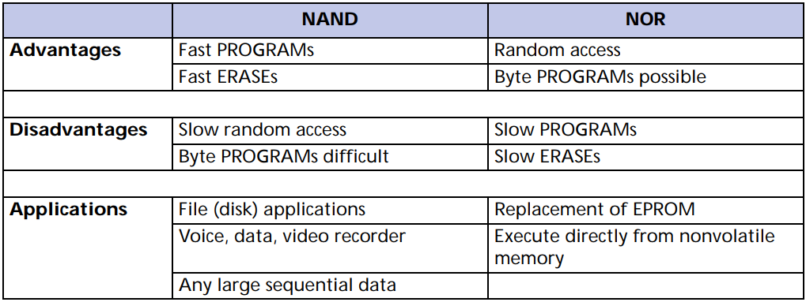

## NAND Flash structure

由于nand flash并不支持随机访问任意位置的内容 , 
它的最小可访问单位称为page , 大小一般为2K , 
而如果需要修该page中的内容之前 , 需要先擦除该page , 
而最小的擦除单位称为block , 大小一般为128K , 
所以一个block一般包含64个page , 也就是说一次擦除操作
最少会擦除64个page的内容 . 
当然 , 每个page还会包含一个spare区域 , 该区域主要
用户存放ecc校验数据、坏块标记、以及剩下的用户可以自定义的部分 , 
该区域的大小根据不同的颗粒为64或者128字节 , 
下图是一个2Gb nand flash的整体结构图 :

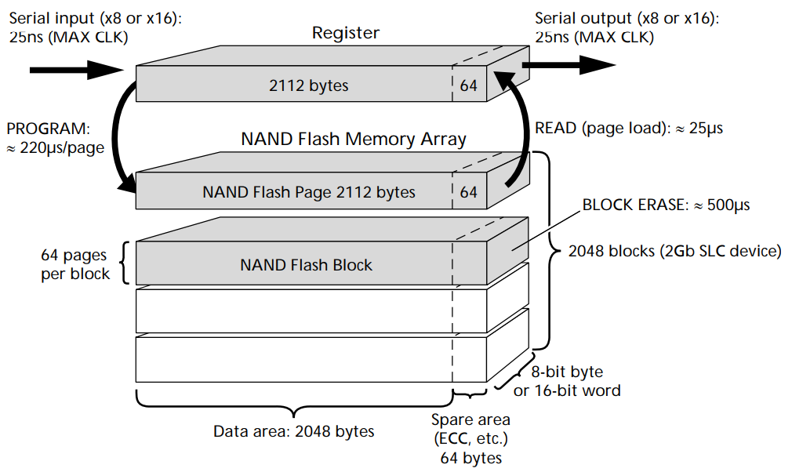

由于ecc校验机制的最小操作单位一般为512字节 ,
所以 , 一个page的数据区通常又分为多个sector , 每个sector的大小为512字节 , 
而page中sector和spare区域的分布，主要分为以下两种 :

该数据分布主要用于nand flash , 每个sector之后都跟随一个16字节的spare区域 , 
主要用于存放ecc.

该结构主要用于spi flash , sector和spare区是分开存放的.

## Hardware signal

nand flash颗粒一般和 flash controller通过硬件管脚连接 , 
控制器负责通过这些管脚发送相关的命令 、交互数据内容 , 
数据线的位宽一般为8bit或16bit , 除了数据线 , nand flash
一般还包含以下6个控制信号线 :

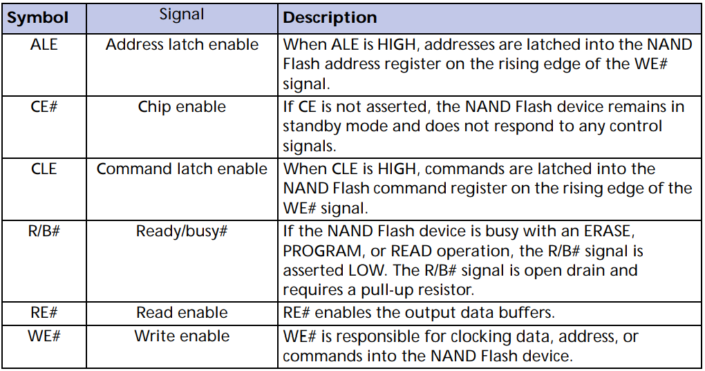

( '#' 代表低电平有效 )

在同一时刻, 8bit/16bit的数据在 WE# 的上升沿被写入到flash中 , 
同理 , 在同一时刻, 数据在 RE# 的上升沿从flash中读出 , 
而所有对flash的操作 , 首先都是先发送一个命令操作码 , 
该操作码通过数据线在CLE高电平时被颗粒接收 , 
紧接着 , 如果是读写操作 , 还会跟随一个地址 , 用于标示该
操作的在颗粒中的位置 , 下图是一个典型的读一个page的时序图 : 

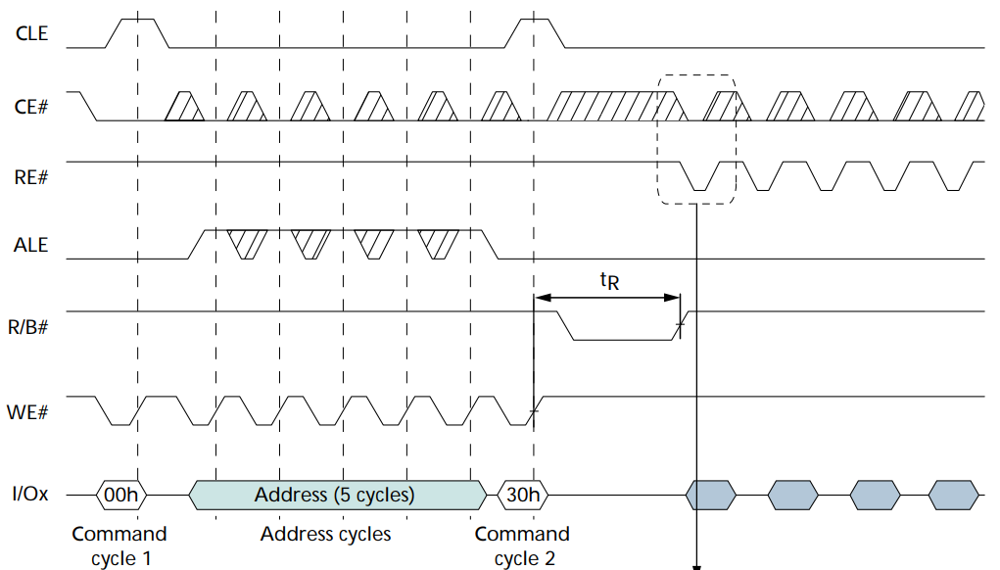

## Commands

flash操作都是由不同的操作码来标示 , 对于不同的操作 ,
所需的command、address以及data cycle都是不同的 , 
下图是常见的flash操作所对应的cycle :

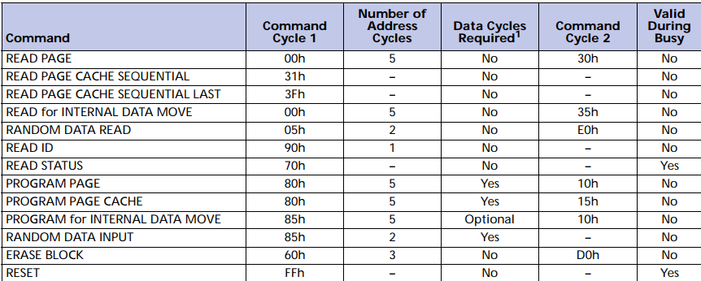

而在每个cycle中 , 对于address和command无论数据线是8bit还是16bit
都只能传递8bit , 所以这里会看到用多个cycle来传递address或者command的情形 .

这里我们详细看下address是如何传递的, 首先我们假设 :
page的大小为2k , spare的大小为64字节, 一个block包含64个page , 而整个flash包含2048个block , 
那么对于page内的寻址我们需要11个bit , 而对于block内page的寻址我们需要6个bit ,
而对于flash中block的寻址我们需要10个bit , 这样加起来是27个bit ,
对于一个cycle只能传递8bit , 我们至少需要4个cycle , 那为什么read page操作时
需要5个cycle呢 , 其实 , 真实的地址是这样传输的 :

这里 :

- CA: colomn address 表示一个page内的寻址
- PA: page address 表示一个block中对page的寻址
- BA: block address 表示flash中对block的寻址

### reset command

reset 命令一般用于颗粒上电之后的复位 , 以及在操作过程中颗粒状态出现错误时的
补救措施 , reset命令会立刻终止之前还没完成的操作 , 并叫颗粒复位到初始状态 .

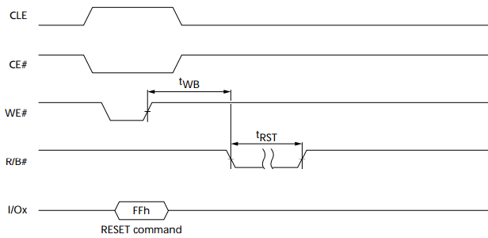

### read id command

read id命令用于读取flash颗粒的id信息 ,包含厂商、型号、颗粒结构等信息 

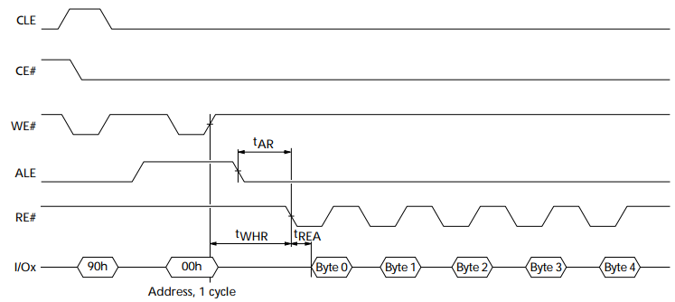

### read status command

read status命令用于查询flash颗粒当前的状态 , 或者之前操作是否完成 .

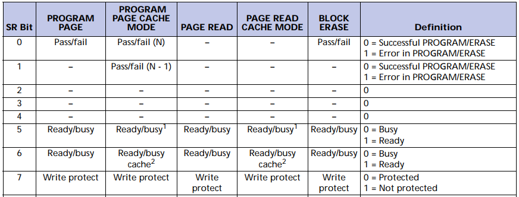

### erase command

对于flash颗粒的内容的修改 , 在最低层其实是将1变为0的过程 ,所以在
任何对内容的修改之前 , 都需要将对应的bit置1 , 而这个操作就是erase , 
该操作按照block来进行的 , 所以根据之前的address传递方式 , 这里只需要cycle
3、4、5这三个cycle .

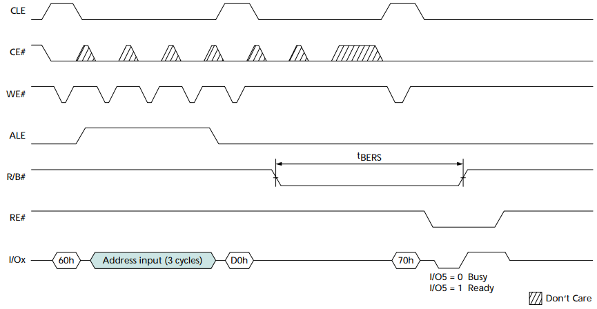

### program command

program操作只能将对应的page中的bit置0 , 操作的最小单位为一个page . 

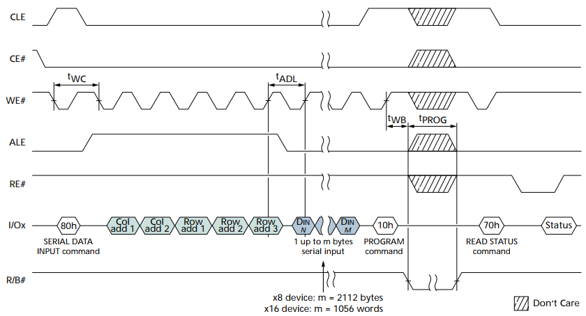

### read command

read操作用于从flash中读取数据 , 每次读取一个page的数据 . 

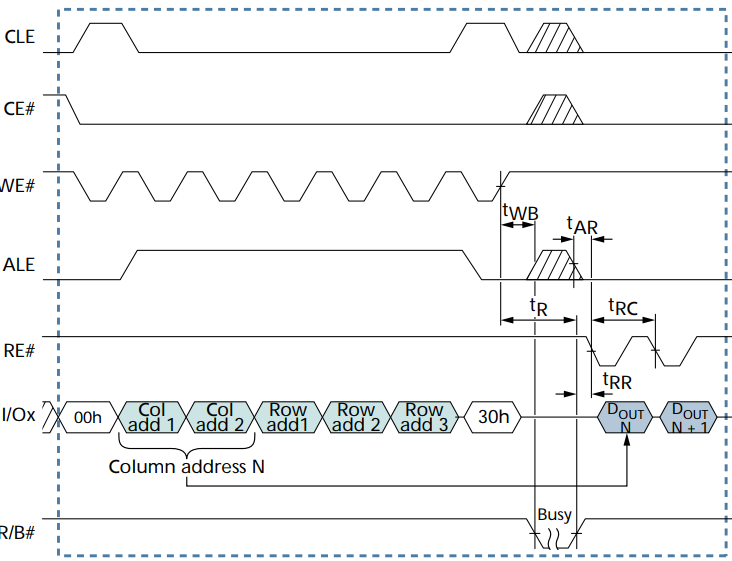

### read page cache command

之前我们看到从flash读取数据时 , 颗粒内部都是先将数据搬到一个data register中 , 
之后controller再从该register将数据读出 , 但是这样在读连续的多个页数据时 , 
性能是很差的 , 因为每次我们都需要等待颗粒将数据搬到data register中 .
所以现在很多颗粒都提供cache read mode , 当打开该模式时 , 颗粒内部会打开一个
cache register , 当其空闲时 , data register的数据会被快速的搬到其中 , 
之后自动load下一页的数据 , 而当controller将cache register中的数据读出之后 , 
在data register中的新的数据就可以快速的再次填充到cache register中了 . 

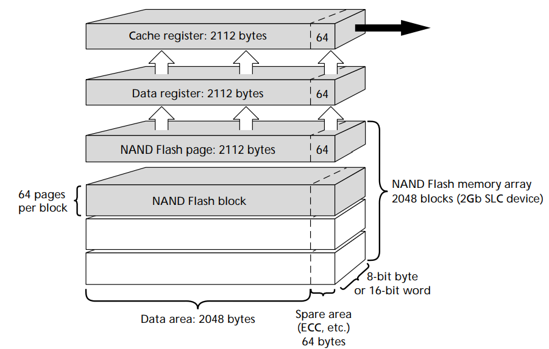

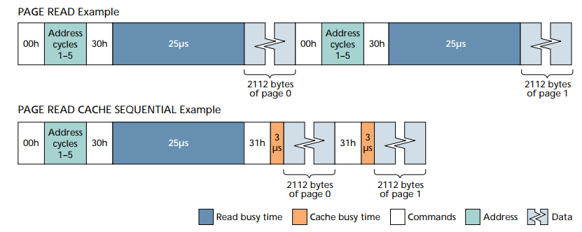

### program page cache command

和read page的cache思路一样 , 当program page时 , 采用cache模式同样可以提高
性能  , 具体的结构和时序如下 :

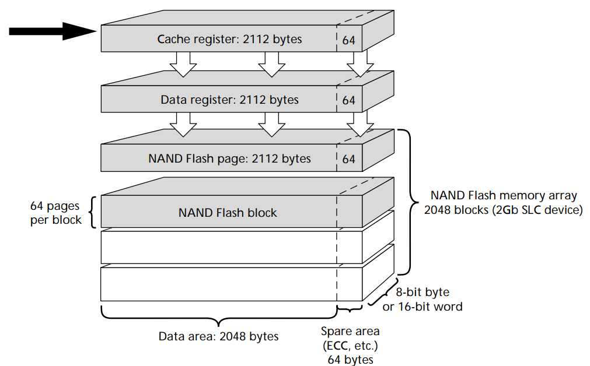

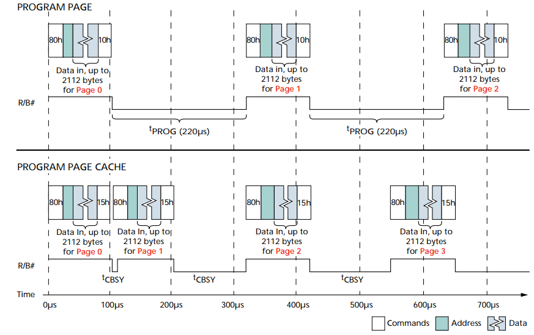

## ECC

nand flash 由于硬件特性的原因 , 部分bit在读取时会发生跳变 ,
所以我们需要使用ecc机制来纠正这种情况 , 该机制可以由硬件实现 , 
也可以由软件实现 , 这里我们这讨论硬件ecc .

当program page时 , 颗粒会以sector为单位计算ecc , 并将计算的结果保存在
spare区 , 当读取一个page时 , 颗粒同样会计算ecc , 并和保存的ecc继续比较 , 
如果发现不同 , 则会根据使用的ecc算法进行bit矫正 , 当然如果发生跳变的bit
数超过了ecc算法所能纠正的最大位数 , 则颗粒会ecc状态位标记 , 控制器可以
读取该状态 , 来判断读取的数据的有效性 . 

常用的ecc校验算法主要有 :

- Hamming codes: 该算法最多只能纠正1bit的跳变
- Reed-Solomon codes: 该算法较hamming code可校验的bit位数更多
- BCH codes: 该算法同样可以校验多个bit跳变 , 而且性能也是最好的 , 现在大多数颗粒都是采用这种算法

对于不同校验bit数 , 不同的算法所需的ecc codes的位数也是不同的 ,
具体见下图 :

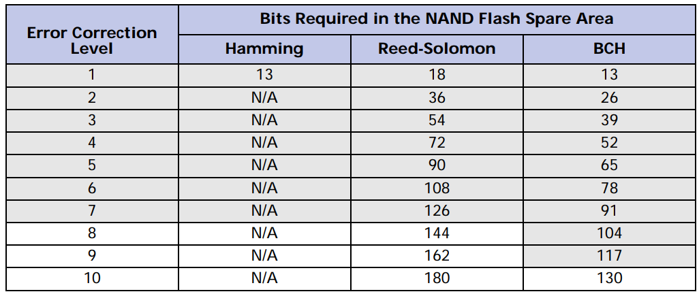

注意 , 这里的纠正位数是在一个sector中的 .

## Bad block

每个颗粒在出厂时 , 厂商经过测试会明确标记一个block为bad block , 
所以我们在使用时 , 需要知道些信息 , 从而避免使用bad block , 
该信息称为坏块标记 , 一般保存在每个block的第一page的spare区 , 
而在spare区域的具体位置 , 对于page size为512byte , 那么spare区域的
第六个字节不为0xff则认为是bad block , 而对于page size为2k ,
那么如果spare区域的第一个字节不为0xff则认为是bad block .

在烧录一个flash时 , 对bad block的处理也有以下几种选择 .

### Skip bad block

到遇到一个bad block时 , 会跳过该block 并将数据写入到和该坏块连续的下一个
good block中 :

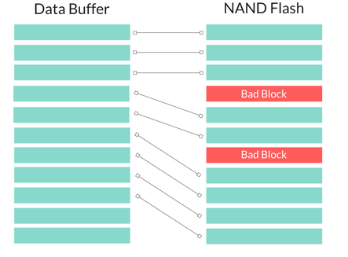

### reserve block

该方法将整个flash颗粒分为user block area(uba)和reserved block area(rba)
当uba中遇到某个bad block会使用rba中的一个good block进行替换 , 
同时 这些bad block和good block的映射关系会通过一个table的范式保存在
flash中的固定位置 , 具体结构如下 :

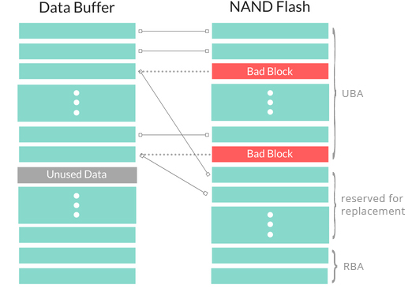

### write over bad block

该方法是忽略坏块标记 , 即不考虑坏块 , 该方法一般用于软件会判断数据的可靠性 . 

FIN
