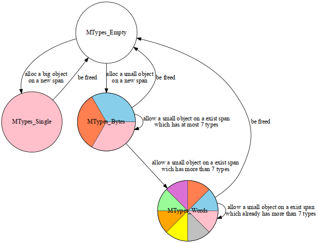
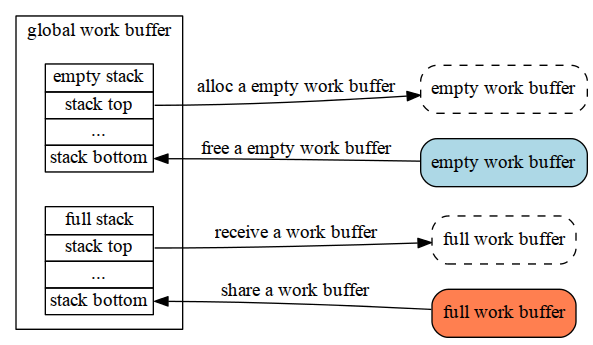

+++
title = "Read Go - GC"
date = "2013-04-08T14:23:00"
tags = ["go"]
+++

这篇文章继上篇[Read Go - memory](/post?q=Read_Go_-_Memory),
主要讲下垃圾回收的机制，过程中会涉及到go的type系统以及线程调度相关内容,
在此就不对其进行深入的分析，等到后续的有针对性的深入的讲解。

## 触发条件

gc的触发条件是由一个环境变量GOGC去控制的，
该变量的取值有如下2种：

- "off": 关闭gc。
- 百分数: 比如为100,假定当前使用了4Mb的内存，
那么当使用的内存到达8Mb(4*(1 + 100/100))时，触发gc。
如果该环境变量没有设定，则认为是100。
这样的设计的原因是为了保持gc的触发次数和使用的内存成线性的关系。

## Mark-and-Sweep

go的gc用的是[Mark-and-Sweep](http://www.brpreiss.com/books/opus5/html/page424.html)算法，
根据算法的要求，在gc的时候，其他的程序必须暂停，等gc执行完成再重新恢复暂停的程序，
所以整体的执行流程如下：

1. stoptheworld
2. mark
3. sweep
4. starttheworld

下面分别介绍mark和sweep步骤。

### Mark

#### preparation

在mark之前有一件事必须先准备好，那就是我们需要mark的object（也就是算法中所谓的root），
当准备好所需要mark的root之后，它会依次遍历每个以root为根的树,最终完成mark过程。

那么我们需要mark那些内容呢？

1. data段
2. bss段
3. heap(以span为单位)。
4. stack
5. Finalizer（以span为单位）

这里我们主要关注heap部分（data和bss比较简单，stack和Finalizer部分等待后续开专题分析），
由于heap总体上是由一个个的span组成的，而每个span内部可能会存在更细粒度的object，
所以在每个span都有一个type信息，顾名思义其中记录着该span中每个block的type。
type的类型有如下几种：

- `MTypes_Empty`： 该span下的所有block都被free，或者没有type信息。
- `MTypes_Single`： 该span下只包含一种object（例如一个大数据块）。
- `MTypes_Words`： 该span下包含多于7种不同类型。
- `MTypes_Bytes`： 该span下包含最多7种不同的类型。

可以看出上述4种类型可能会存在类型之间的迁移，具体的类型迁移如下图所述：

#### The simple way

清楚了我们该mark哪些内容，开始mark吧，其中比较直接的方法是采用递归的办法依次遍历每颗树。

在遍历的过程中，首先找到*object所在的span，从而确定object的开始地址。
知道了开始地址，下一步就是在bitsmap中找到其对应的4个bit，最后将它的`bitSpecial`置1。
当然，如果该地址是一个二级指针，递归mark下去。

#### The complex way

可以明显的看出，如果递归的层数太深，上述的方法效率比较低，
为了提高效率，go采用了另外一种并行的多线程的方案。

这其中有两个方面的优化，我认为一个叫广度，一个叫深度：

- 广度： 设想一个执行10×10000的for循环，且每个循环体之间没有任何耦合，
如果是一个线程，那么这个线程需要执行10×10000此，那么如果是10个线程同时执行呢？
对，每个线程只需要执行10000次，这样所需要的时间也将是原先的1/10。
- 深度： 这里主要考虑递归层数很深的情况，stack frame的push和pop极大的影响了性能。
那么如果去除这个递归呢？go中使用的方法是抽象出一个work queue，
多个工作线程，从该work queue中获取任务，这样就将原先的递归给分解了。

先来说"广度"，在go中的说法是`parallel for`,主要的实现在parfor.c中，
其中的主要逻辑也很简单，就是根据并行的thread数将循环的此欢平分，
每个thread有自己的start，now，end这3个位置信息，其中now每次+1。

不过其中有个比较tricky的设计，如果其中一个thread很早完成了自己的任务，
但是其他的thread还没有完成，该thread会随机选择一个还没有完成的thread，
为其分担一半的剩余工作量（src里称之为steal...）

下面来说下"深度"，首先，每个thread有自己本地的work buffer，
同时还有一个所有线程共享的全局work buffer。
开始每个线程本地的work buffer都为空，
在mark的过程中，首先会将object放入本地的work buffer中，
如果本地的buffer满了，会将该buffer push到全局work buffer的full stack中，
然后在全局work buffer的empty stack pop一个新的空的work buffer继续mark。
每次mark都是首先从本地的work buffer中获取object，
如果本地的work buffer已经没有object了，那么它会从全部work buffer的full
stack中pop一个buffer进行充填, 同时将原先的空的work buffer push到全局work
buffer的empty stack中。

可见，这是一种边遍历边mark的过程:

**NOTE**: 这里有个corner case需要注意下，如果需要从全局work buffer的full
stack获取一个work buffer，
但是此时该stack又为空怎么办？
go采用的办法是：等，而等的策略如下（优先级按先后顺序）：

1. busy wait（for循环20次）
2. os yield（放弃当前thread的时间片，将其插入可执行queue的最后）
3. sleep（usleep（100））

当然，在将object放入本地work buffer之前，会判断这种情况，
如果确实存在这种情况，会将本次的需要放入的objects的一半放入到全局的full
stack中,供其他线程来取，
而自己本地只保留剩下来的另一半objects。

#### What are they

现在我们已经有了object了，那么这些object到底是什么类型的呢？chan？map？array？或者只是一个void*?
下一步我们必须知道这些object具体的类型。

其实这些类型信息都存放在”指令“中，为什么说是指令呢，
设想如果一个指针指向一个数组，除了知道类型是数组以外，
还必须知道数组的开始地址，数组中元素的大小，数组中元素的个数这些信息。
为了将这些信息聚合在一起，这就形成了go中的”指令“。

而每个”指令“一般由2部分组成：opcode和argument,当然也可以只有opcode没有argument。

那么这个”指令“从哪去获取呢？是这样的：
首先通过map找到object指针所在的span，
我们说过span中有存放其中包含的block的type信息，
通过这个type信息就可以找到其对应的type描述符（struct Type）。
而其中有个gc字段（void*）就是该object对应的“指令”。

有了“指令”，go通过一个状态机去解析这些指令，
在解析的过程中，会根据具体的type信息，mark这些object指针
（在bitmap中将其bitMarked位置1），
当然，如果该指针是一个二级指针,会将其指向的地址重新放入到work buffer中，
进行深入的mark。

OK, mark过程就说到这。
对于上述说到的“指令”状态机，有兴趣的同学可以看下它的具体的实现（见scanblock函数，这个函数有将近500行哦！）。

### Sweep

经过了mark，sweep过程就比较简单了：遍历所有的span，依次扫描它包含的object，
如果发现该object被mark了，clear该标记，为下一次的mark做准备;
反之，如果发现该object没有被mark，则将其释放。
（从哪来回哪去：如果是big object，直接在heap上将其释放，
如果是small object，将其释放给全局的MCentral）。

## Conclusion

这样整个的mark-and-sweep过程就完成，这其中有一些细节没有涉及：

1. split stack的实现。
2. Finalizer机制。
3. go中type系统（map的实现，chan的实现，等等）。
4. go中的线程调度。

To be continue...
