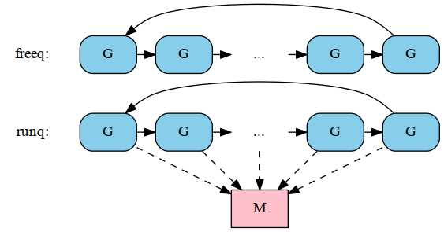
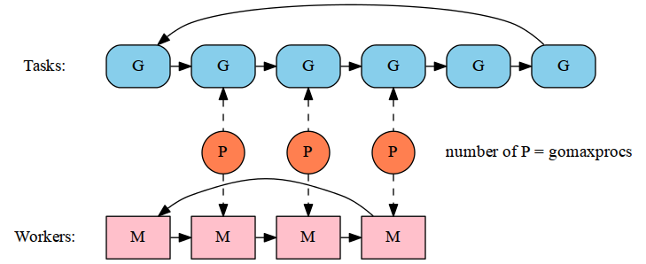

---
categories:
- Read Go
date: 2013-05-21T11:34:00
tags:
- go
title: Read Go - Schedule
---

今天主要说下Go中的schedule([这是设计文档][1]), 首先有一点必须明确:

- 调度的对象是goroutine,而不是os thread.

这是因为goroutine是在os thread的基础上multilplex的产物,
简单的说,就是多个goroutine跑在一个os thread上,
而schedule就负责在不同的goroutine之间调度.

[1]: http://golang.org/s/go11sched

在开始讲如何调度之前,有几个基本概念必须先搞清楚.

## M (worker thread or machine)

这其实就是os thread在go中的抽象,
既然是os thread,那么它的创建想必是通过clone系统调用,的确是这样:

~~~
void
runtime·newosproc(M *mp, void *stk)
{
	...
	ret = runtime·clone(flags, stk, mp, mp->g0, runtime·mstart);
	...
}
~~~
这里的几个参数:

- flag:

~~~
flags = CLONE_VM	/* share memory */
	| CLONE_FS	/* share cwd, etc */
	| CLONE_FILES	/* share fd table */
	| CLONE_SIGHAND	/* share sig handler table */
	| CLONE_THREAD	/* revisit - okay for now */
	;
~~~
可见clone出来的线程和当前线程共享虚拟内存(vm),
文件系统环境,文件描述符,信号回调函数,并且同属一个线程组.

- stk: 预先分配好stack,大小为8192.
- mp: 是一个M*指针,只想分配的struct M结构.
- mp->g0: schedule goroutine,在同一个M上的所有goroutine都由它去统一调度.
- runtime·mstart: 线程最开始执行的函数(runtime·mstart, 后面会有介绍).

这样一个M就创建出来,其中每个M都有个id用于标识,
并且有个全局的M链表(runtime·allm)用于遍历所有的M:

~~~
static void
mcommoninit(M *mp)
{
	...
	mp->id = runtime·sched.mcount++;
	...
	// Add to runtime·allm so garbage collector doesn't free m
	// when it is just in a register or thread-local storage.
	mp->alllink = runtime·allm;
	// runtime·NumCgoCall() iterates over allm w/o schedlock,
	// so we need to publish it safely.
	runtime·atomicstorep(&runtime·allm, mp);
	...
}
~~~

## G (goroutine)

首先是g的申请,策略是这样的:

- 如果本地有之前释放的G(本地有个free list),直接从其中去获取,
这样节省一次gc malloc.
如果没有则只能通过gc malloc申请新的G.

和M一样,G也有一个全局的链表(runtime·allg)用于遍历所有的G,
以及id用于标识.

那么在每次goroutine schedule时,调度器是如何知道goroutine的运行状态呢？

~~~
struct	G
{
	...
	int16	status;
	Gobuf	sched;
	FuncVal*	fnstart;		// initial function
	...
}
~~~

- status: 可能的取值如下:

~~~
enum
{
	Gidle,
	Grunnable,
	Grunning,
	Gsyscall,
	Gwaiting,
	Gmoribund_unused,  // currently unused, but hardcoded in gdb scripts
	Gdead,
};
~~~
新创建的goroutine初始状态为Grunnable.

- sched: 下一次调度该goroutine时,对应的PC,SP, G的取值,
从这里可以看出,在调度之前,每个goroutine准备好下一次的运行环境,
调度时只是还原预先准备好的环境而已.
- fnstart: 该goroutine最开是执行的函数.
这里读者可能会奇怪,在sched中存放这下一次调度时执行的PC,
而这里又冒出来一个fnstart这样的一个PC,那么到底该执行哪个PC?
这里有个trick,每个goroutine在创建时,其sched.pc都指向runtime·goexit,
并且fnstart被设置成最先执行的函数,
这样当执行的调度时,如果发现sched.pc为runtime·goexit, 则将PC设置成fnstart,
其他情况便将PC设置成sched.pc

~~~
G*
runtime·newproc1(FuncVal *fn, byte *argp, int32 narg, int32 nret, void *callerpc)
{
	...
	newg->sched.pc = (byte*)runtime·goexit;
	newg->fnstart = fn;
	...
}

static void
execute(G *gp)
{
	...
	if(gp->sched.pc == (byte*)runtime·goexit)  // kickoff
		runtime·gogocallfn(&gp->sched, gp->fnstart);
	runtime·gogo(&gp->sched, 0);
}
~~~

M默认情况下处于start状态,不过M也有可能被调度器设置成stop状态,
在stop状态下,M被挂入一个信号量的等待队列(m->park).

## P (processor)

P的概念有点像进程环境,它表示程序运行所需的所有的资源,
那么程序运行所需的资源是什么呢？
没错,就是上述的M和G,其实P就是为这两者建立联系,
只有M和G建立好了联系,才能完成execution,两者缺一不可.

之前我们说过多个G对应1个M,那么我们来看下P是如何这个1`<->`n的关系的.

可见,对于G有2个队列,一个是用于存放那些Grunnable的G,
而另一个则用于存放那些Gdead的G.

这2个queue都是属于P本地的,除此之外,还存在一个全局的runq(runtime·sched.runqhead).
当P尝试从本地的runq获取G失败时,会尝试从全局的runq获得G.
如果从全局的runq也没有可用的G,当前的P会随机从其他的一个P的runq中steal一半的G填充到本地的runq中.

因为P抽象了程序运行所需的资源,这里go利用了这个特点,控制了程序的并发性(同一时间上,并行执行任务(G)的数量:

从上图可以看出虽然有很多任务,且有的os thread 也处于stop状态,
不过由于总共只有3个P,所以同一时间只有3个task在执行.

## schedule

清楚了M,G,P这三个抽象概念,下面我们来看下执行调度时,是如何将三者联系起来,共同完成调度的.

- 首先当M执行完预先准备的函数(m->mstartfn),会尝试从与之关联的本地P中获取可执行的G,
- 如果本地P中没有,则从全局的runq中尝试获取.
- 如果依旧没有,这里runtime或去执行net poll(因为go中network实现是异步的,轮询的工作交给了runtime去代理),
- 如果的确有网络的数据的接收和发送需要完成,会生产一些G,并将其放入全局runq中,
- 如果还是没有,这时M会进入spining状态(即将进入stop状态),不过处于spining状态的M不应该太多,因为这样CPU的利用率会很高,同时此时程序的并发性也不理想.
所以这里会有一个限制:

~~~
static G*
findrunnable(void)
{
	...
	// If number of spinning M's >= number of busy P's, block.
	// This is necessary to prevent excessive CPU consumption
	// when GOMAXPROCS>>1 but the program parallelism is low.
	if(!m->spinning && 2 * runtime·atomicload(&runtime·sched.nmspinning) >=
		runtime·gomaxprocs - runtime·atomicload(&runtime·sched.npidle))
		goto stop;
	...
}
~~~
- 进入spining状态的M会做最后一次尝试,就是随机从其他的P中steal一半的G到自己本地.
- 如果仍旧失败了,M只好进入stop状态(挂入信号了等待队列,等待别人唤醒).
同时将本地的P也释放掉,当下次再此被唤醒,会重新获取新的P,从而获取到新的任务去执行.

从上述的过程可以看出,大体的逻辑过程是这样的:

1. M先找到可用的P,一般处于bootstrap阶段创建的M会默认和runtime·allp[0]这个P挂接,
后续生成的M会从runtime·sched.pidle这个list上去获取.
- 如果可用的P,M便进入休眠,等待别人来唤醒.
- 当有了P(程序运行的环境), 下一步便是寻找G(任务)来做.
这里就是上述的各种"尝试与挣扎".
- 如果”尝试与挣扎"失败了,那就只好进入休眠了.

### Corner Cases

下面我们看下在schedule过程可能出现的corner cases:

**case 1: 如果有需要执行的G,且有空闲的P,但是没有处于spining状态的M:**

~~~
static void
schedule(void)
{
	...
	// M wakeup policy is deliberately somewhat conservative (see nmspinning handling),
	// so see if we need to wakeup another M here.
	if (m->p->runqhead != m->p->runqtail &&
		runtime·atomicload(&runtime·sched.nmspinning) == 0 &&
		runtime·atomicload(&runtime·sched.npidle) > 0)
		wakep();
	...
}
~~~
这里首先获得一个空闲的P,
然后,如果有处于休眠状态的M,将其唤醒.
如果没有空闲的M,那么只好创建一个新的M
(注意这里新创建的M开始时什么事都不做,等待调度器分配的任务).

**case 2: stoptheworld/starttheworld:**

stoptheworld用于停止当前正在运行的M,
starttheworld用于恢复暂停的M的执行.

这里主要讨论下,在gc下的stoptheworld和starttheworld.
当gc执行之前,需要将所有的thread都停止(所谓的stoptheworld),
这里主要通过一个flag(runtime·gcwaiting)来通知,
当该标志被置1,所有的M都会停止.

当所有M都处于stop状态之后,会根据需要并行gc的数量唤醒相同数量的M,并开始进行gc
(注意,这里并没有去寻找P,而是直接执行runtime·gchelper).

~~~
void
runtime·helpgc(int32 nproc)
{
	for(n = 1; n < nproc; n++) {  // one M is currently running
		mp = mget();
		...
		mp->helpgc = n; //标识gc thread的id
		...
		runtime·notewakeup(&mp->park);
	}
}

static void
stopm(void)
{
	...
	if(m->helpgc) {
		runtime·gchelper();
		m->helpgc = 0;
		m->mcache = nil;
		goto retry;
	}
	...
}
~~~

当gc执行完成,需要重新唤醒M(所谓的starttheworld),
这里的处理比较简单,唯一需要主要的是,有可能在starttheworld时,
gomaxprocs发生变化,所以这里需要重新初始化runtime·allp.
同时,如果M的数量小于P的数量,也会创建新的M.

**case 3: LockOSThread:**

这里提供了一种机制:
M可以和G进行绑定,也是就说G只能在指定的M上执行.

如果某个M被绑定到某个特定的G时,M在信号量(m->park)上等待,
直到指定的G被调度.

~~~
static void
stoplockedm(void)
{
	...
	inclocked(1);
	// Wait until another thread schedules lockedg again.
	runtime·notesleep(&m->park);
	runtime·noteclear(&m->park);
	if(m->lockedg->status != Grunnable)
		runtime·throw("stoplockedm: not runnable");
	acquirep(m->nextp);
	m->nextp = nil;
}

static void
startlockedm(G *gp)
{
	...
	inclocked(-1);
	p = releasep();
	mp->nextp = p;
	runtime·notewakeup(&mp->park);
	...
}
~~~

**case 4: entersyscall/exitsyscall:**

当一个M执行的G即将进入syscall,如果syscall需要的时间相对较长,
这时,M没有必要因为syscall长期占用这P(因为在syscall的过程中,不需要P)
所以在进入syscall之前,M会释放掉当前占用的P,
当从syscall中返回会重新获得一个P,再次恢复M的运行.

这里有个细节,当释放P时,并没有将P释放到全局的idle list上,
只是将P的状态置为Psyscall, 这里应该有这样的考虑,如果syscall的时间很短,
那么,在exitsyscall时,可以迅速的再次找到entersyscall之前的P,减少一次调度.

如果Syscall的时间确实很长,那么就需要将P真正释放出来,供其他M去获取.
这个工作是由一个单独的线程(sysmon)去做的,
该M会检查每个P,如果P处于Psyscall状态,且时间较长(20us - 10ms),
在将当前的P释放给全局的idle list之前,
需要观察下全局的形式,会根据的一下条件创建新的M:

- 本地P还有需要执行的G.
- 全局P还有需要执行的G.
- 当前没有处于spining状态的M,同时也没有其他空闲的P.
- 没有可用的M去poll network.

FIN
