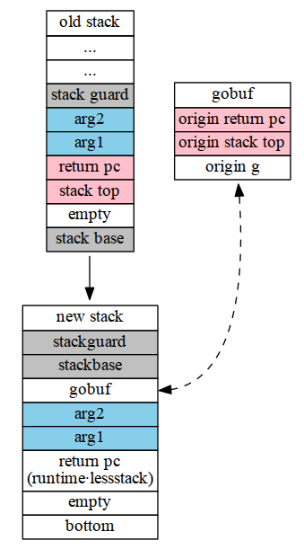

+++
title = "Read Go - Split Stack"
date = "2013-05-08T08:33:00"
tags = ["go"]
categories = ["learning"]
+++

如果大家对split stack还不是很清楚,
这里有一篇[介绍文档](http://gcc.gnu.org/wiki/SplitStacks).
关于split stack有许多实现方案,这里主要看下go中是如果实现的.

## Strategy

一般来说,在每次函数调用之前,都应该检查当前的堆栈指针(SP)是否已经达到或者超过限制的大小(`g->stackguard`),
如果没有,则仍然在当前的stack上完成函数调用,
反之,则需要重新申请一个新的stack,并在新的stack上完成函数调用,
同时,当函数完成调用之后需要将申请的stack释放掉(这里的新的stack是在heap上申请的).

上述就是大致的流程,不过,试想如果有很多函数调用,
且这些函数的function frame size很小,这样必然会有很多heap的malloc/free,
所以,对于这些function frame size很小的函数,
会在原有的限制大小上再容忍一定的大小,这个大小就是`StackSmall`,
那么多大的function frame才算是小呢？同样也有个标准,即`StackBig`,
在运行时,会根据不同大小的function frame判断是否需要申请新的stack:

- `frame size <= StackSmall`:

~~~
if SP <= g->stackguard
	申请新的stack, 并在其上完成函数调用
else
	继续在当前的stack上完成函数调用
~~~

- `StackSmall < frame size < StackBig`:

~~~
if SP+(frame size - StackSmall) <= g->stackguard
	申请新的stack, 并在其上完成函数调用
else
	继续在当前的stack上完成函数调用
~~~

- `frame size >= StackBig`:

~~~
申请新的stack, 并在其上完成函数调用
~~~

## Prepare

我们知道stack就是函数的运行环境(上下文),
而现在需要在新的stack上继续函数调用,
这就带来一个问题,在函数返回时,如何回到之前的上下文环境,
如果你看过kernel中关于进程切换的代码,那就不难回答这个问题.
这里需要保存当前上下文环境:

~~~
TEXT runtime·morestack(SB),7,$0
...
MOVQ	8(SP), AX	// f's caller's PC
MOVQ	AX, (m_morebuf+gobuf_pc)(BX)
LEAQ	16(SP), AX	// f's caller's SP
MOVQ	AX, (m_morebuf+gobuf_sp)(BX)
MOVQ	AX, m_moreargp(BX)
get_tls(CX)
MOVQ	g(CX), SI
MOVQ	SI, (m_morebuf+gobuf_g)(BX)
...
~~~

可以看出保存的信息包括PC,SP,g,而这些信息都存放在`m->morebuf`中,

~~~
struct	M
{
	...
	Gobuf	morebuf;	// gobuf arg to morestack
	...
};
struct	Gobuf
{
	uintptr	sp;
	byte*	pc;
	G*	g;
};
~~~

除了保存之前的上下文信息,当前的函数调用信息也被保存下来,
包括pc,arguments,argument size, frame size,分别对应`struct M`中的如下字段:

~~~
struct	M
{
	...
	void	(*morepc)(void);
	void*	moreargp;	// argument pointer for more stack
	uint32	moreargsize;
	uint32	moreframesize;	// size arguments to morestack
	...
};
~~~

## Allocation

保存好当前的上下文信息,下面就是申请新的stack,这里有2点需要注意下:

1. 当前所在的stack比较特殊,是schedule goroutine的自己的stack,
也就是说,无论之前用的是哪个stack,都会先切换到schedule goroutine的stack,
然后才进行新的stack的申请.
2. 新的stack是在heap上申请的,同时这些空间不受GC的管理:

~~~
void*
runtime·stackalloc(uint32 n)
{
	...
	return runtime·mallocgc(n, FlagNoProfiling|FlagNoGC, 0, 0);
}
~~~

这里有个corner case需要考虑:
如果在malloc/free的过程中需要申请新的stack怎么处理,
这里为了避免dead lock,会有一个全局的共享的free-list提供固定大小的stack.
而每个M中也有一个circle ring,如果该ring空了,就从全局的free-list refill,
同理,如果满了,也会将其release给全局free-list.

有了新的stack空间,下面需要对其进行必要的初始化,
所有的初始化信息都保存在栈顶,一个叫`Stktop`的结构体中:

~~~
struct	Stktop
{
	// The offsets of these fields are known to (hard-coded in) libmach.
	uint8*	stackguard;
	uint8*	stackbase;
	Gobuf	gobuf;
	uint32	argsize;

	uint8*	argp;	// pointer to arguments in old frame
	uintptr	free;	// if free>0, call stackfree using free as size
	bool	panic;	// is this frame the top of a panic?
};
~~~
可以看出,这里保存着原来的stack信息,以及当前的函数调用的信息.

~~~
void
runtime·newstack(void)
{
	...
	top->stackbase = (byte*)gp->stackbase;
	top->stackguard = (byte*)gp->stackguard;
	top->gobuf = m->morebuf;
	top->argp = m->moreargp;
	top->argsize = argsize;
	top->free = free;
	top->panic = gp->ispanic;
	...
}
~~~

## Switch

有了新的已经初始化好的stack,下面就是准备stack switch:

~~~
void
runtime·newstack(void)
{
	...
	gp->stackbase = (uintptr)top;
	gp->stackguard = (uintptr)stk + StackGuard;
	...
}
~~~
另外,如果当前的函数有参数,也需要将参数拷贝到新的stack上.

最后,进行真正的跳转:

~~~
TEXT runtime·gogocall(SB), 7, $0
	MOVQ	24(SP), DX	// context
	MOVQ	16(SP), AX		// fn
	MOVQ	8(SP), BX		// gobuf
	MOVQ	gobuf_g(BX), DI
	get_tls(CX)
	MOVQ	DI, g(CX)
	MOVQ	0(DI), CX	// make sure g != nil
	MOVQ	gobuf_sp(BX), SP	// restore SP
	MOVQ	gobuf_pc(BX), BX
	PUSHQ	BX
	JMP	AX
	POPQ	BX	// not reached
~~~
可以看出这里切换的有g,SP.

细心的读者可能会发现在`JMP AX`之前向stack上push了一个函数返回地址,
为什么要这么做呢?

回想最开始说到的整个流程,当完成函数调用之后,需要释放之前的申请的stack空间,同时回到之前的上下文环境中,对,正是因为需要这样才需要手动的填写返回地址.

这个返回被设定为`runtime·lessstack`:

~~~
void
runtime·newstack(void)
{
	...
	// Continue as if lessstack had just called m->morepc
	// (the PC that decided to grow the stack).
	label.sp = (uintptr)sp;
	label.pc = (byte*)runtime·lessstack;
	label.g = m->curg;
	if(reflectcall)
		runtime·gogocallfn(&label, (FuncVal*)m->morepc);
	else
		runtime·gogocall(&label, m->morepc, m->cret);
}
~~~

回跳的过程和之前的跳转的过程正好相反
(将函数参数从新的stack上copy到旧的stack上,释放新的stack空间, 还原g和SP)

## Conclusion

最后,我们来看下整个stack的变化:

FIN
