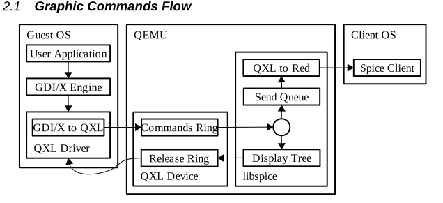
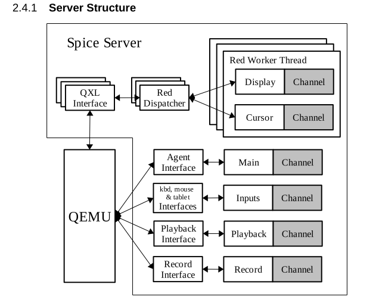
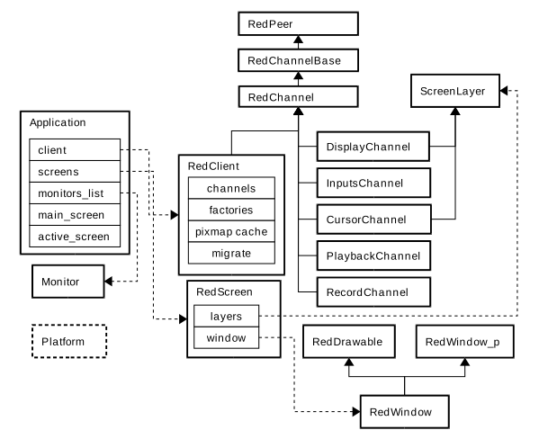

---
categories:
- work
date: 2015-07-09T13:00:00
tags:
- QXL
- spice
title: Spice简介
---

## 介绍

`Spice` 是一个开源的远程访问的解决方案,客户端可以通过它访问远程机器,
包括显示,键盘,鼠标,音频等等.
它将大部分 `CPU` 和 `GPU` 的工作分发到客户端,从而使得客户端能够像本地机器
那样操作远程机器.

## 架构

该系统主要包括以下几部分:

- `Spice` `protocol:` 负责客户端与服务器端之间数据格式的定义.
- `Spice` `server:` 是 `Guest` `OS` 与客户端数据交互的桥梁.
- `Spice` `client:` 将本地的用户操作传递到服务器端,同时从服务器端接收命令,在本地系统实施.
- `QXL` `device` 以及 `driver:` 虚拟的显示设备

这里,通过图像命令的传递流程来讲这几个部分串联起来.

上图显示Spice的基本架构,以及guest到client之间传送的graphic命令数据流,当Guest OS上一个user应用请求OS图形引擎执行一个渲染操作.图形引擎传送命令给QXL驱动,QXL驱动会把OS命令转换为QXL命令然后推送到QXL设备的commands RIng缓冲中.commands Ring是QXL Device中的一个队列.Libspice会从这个commands Ring取得命令数据,然后加到graphics命令树上.显示树上包含一组操作命令,这些命令的执行会产生显示内容.这棵树可以优化掉那些会被覆盖掉的命令,命令树还用来检测video数据流.当命令从libspice的发送队列发送给客户端时,发送命令被转换为Spice协议消息,同时这个命令从发送队列和树上移除.
当libspice 不再需要一个命令时,它被推送到release ring.驱动使用这个队列来释放相应的命令资源当客户端从libspice接收到一个命令时,客户端使用这个命令来更新显示.

### Spice Server

`Spice` `server` 主要有一下两部分任务:

- 与客户端通过 `Spice` `protocol` 进行数据交互,这里根据不同的数据类型,抽象出不同类型的 `channel` , 它封装了底层的传输(TCP/UDP).
- 与 `guest` `os` 通过 `VDI` 进行数据交互,获得从虚拟机传递过来的数据.

#### Red server

`Red` `server` 主要负责图像显示子系统的工作,整体架构如下:

对于每个显示设备,都会开启一个线程( `red` `worker` )专门处理相关的命令处理,
命令可能来自 `Spice` `server` ,这类命令,都是通过 `dispatcher`
的 `socket` 传递过来, 另一部分则来自于 `QXL` 设备,
这里主要是通过 `QXLInterface` 从 `QXL` 设备中获得命令,
而 `QXL` 设备通过 `QXLWorker` 对 `Red` `server` 发送命令.

##### Red worker

`red` `worker` 主要完成以下功能:

- 处理 `client` 端发送过来的 `qxl` 命令
- 处理 `dispatcher` 分发过来的消息
- 处理 `display` 和 `cursor` 通道的数据
- 图像压缩
- 视频流的创建和编码
- 对 `client` 端的缓存的维护
- 优化图像数据,删除那些被遮挡以及透明区域等
- 维护cpu和gpu渲染
- 通过 `ring` 来维护软件抽象的对象

##### Red dispatcher

`red` `dispatcher` 主要功能如下:

- 对 `qxl` 抽象设备提供对 `red` `worker` 操作的接口
- 创建 `red` `worker` 线程,以及相关的初始化
- 通过 `socketpair` 与 `worker` 线程进行通信
- 对 `red` `server` 提供对图像,视频流,鼠标,渲染器操作的接口

### QXL device and driver

`qemu` 会虚拟出一个 `qxl` `pci` 设备负责将系统图像相关的操作
转化成 `qxl` 命令.

设备与驱动的通信主要有以下几种:

- `command&cursor` `ring:` 负责将图像显示操作,传递给 `spice` `server`
- 中断: 虚拟显示设备通知 `guest` `os` 显示相关的事件.
- `io` `port:` `guest` `os` 通知虚拟显示设备.

### Spice client

下面是 `spice` `client` 的类结构图:

这里主要介绍下面两个主要模块: `channel` 和 `window`

#### channel

客户端与服务端的数据通信被抽象成 `channel` 的概念.
具体的底层实现,是通过 `tcp` 协议来完成的,
当然,该数据连接可以通过 `ssl` 来完成数据的加密,
从而提高安全性. 每个 `channel` 在客户端都会有独立
线程去操作,这样就可以通过设置线程的优先级来实现
`channel` 的 `qos` .

`channel` 主要有以下几种类型:

- `main:` 负责对其他类型的 `channel` 的实例化,包括创建,连接,断开,配置等等
- `display:` 处理图形图像,以及视频流的相关操作
- `input:` 处理键盘以及鼠标的操作
- `cursor:` 处理鼠标的位置,可见度相关的处理
- `playback:` 处理从服务端传送过来的音频的播放
- `record:` 记录客户端的相关音频信息

通过创建多个相互之间独立的 `channel` 就可以有效提高
效率以及用户体验,减少相互之间的影响.

#### window

在 `window` 中,主要有两个模块:

- `layer:` 负责维护窗口的显示内容,包括更新,清除等操作, `layer` 之间通过 `zorder` 来维护层次关系.
- `drawable:` 对平台相关的渲染操作操作的抽象,包括拷贝,叠加等等

## Features

### 图像命令

`Spice` 传递和处理 `2D/3D` 的图像命令,
而不是像其他远程桌面解决方案那样,传递整个帧数据.
而且这些图像命令是与平台无关的.

### 硬件加速

默认情况下,客户端的渲染是使用 `Cairo` ,
它是一个跨平台,设备无关的2维图像库,
当然,我们可以通过 `opengl` 使用客户端本地
的 `gpu` 来完成渲染的工作,从而加速了渲染的操作,
同时减轻了 `cpu` 的负担.

### 图像压缩

`Spice` 提供了 `Quic` , `LZ` 以及 `GLZ` 三种图像压缩方案.
我们可以在服务器端启动时,进行选择,同时在运行期间动态选择.
当然 `Spice` 也可以根据图像的属性选择合适的压缩方案.
例如,人工图片用 `LZ/GLZ` 压缩,而真实的图片用 `Quic` 压缩.

### 视频压缩

由于视频数据会消耗很多带宽,而且其内容大部分也不是关键的,
所以 `Spice` 使用了有损的压缩格式 `M-JPEG` 来传输视频数据.

### 缓存

为了避免重复的图像传输, `Spice` 实现了对图像的缓存,
不同的图像有不同的 `id` ,每个连接有自己的缓存,
它们是相互独立的. 缓存是存放在客户端,而对其的操作
则由服务端来维护,当 `display` `channel` 初始化时,
客户端创建缓存, 并将缓存的大小返回给服务端.
当缓存空间不足,服务端会删除那些最不常用的对象,
并通过独立的命令告知客户端,客户端将其从缓存中删除.

### 鼠标模式

`Spice` 支持以下两种模式:

- `Server` `mouse:` 在 `guest` `os` 中用的是 `QEMU` 模拟的 `ps/2` 鼠标,当客户端在本地按下时,服务端会收到相对坐标信息,这里的参考点是屏幕中心,同时客户端的鼠标会立即返回到屏幕中心.
- `Client` `mouse:` 服务端会收到绝对坐标信息,当服务端受到客户端传递过来的坐标信息,会通过 `scale` 操作映射到 `guest` `os` 的屏幕上,通过也会过滤掉那些非法的坐标信息.

### 多个显示器支持

`Spice` 支持多个显示器,同时,
客户端可以通过命令对屏的分辨率以及相关的配置进行设置.

### 2路音频和 Lip-sync

`Spice` 支持音频的播放的和记录,使用的是 `CELT` 压缩算法.
音频和视频之间用过 `Lip-sync` 进行同步.

### 硬件鼠标

`QXL` 设备支持鼠标的硬件加速,从而将鼠标从显示系统中分离出来,
这样会获得更好的相应速度,同时也可以减少网络传输.

### 热迁移

服务端之间的迁移对于客户端而言是无缝的,
所有的连接信息,都在源端备份,同时将其还原到目标端.

FIN.
