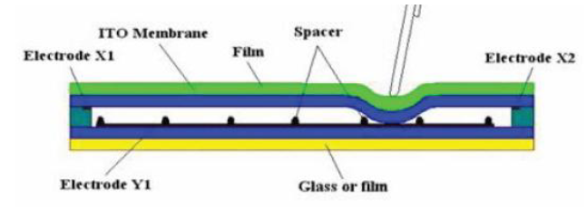
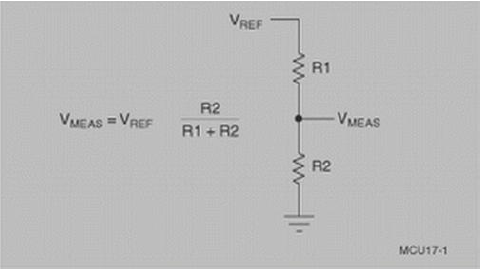
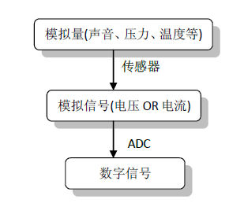

---
categories:
- learning
date: 2013-11-11T09:17:00
tags:
- linux
- kernel
- driver
title: Linux Touch Screen driver
---

## 简介

这篇文章分析linux中touch screen的驱动,这里拿s3c2410中的触摸屏作为例子,
主要内容包括:

- 触摸屏原理
- 代码分析

## 原理

当我们按下触摸屏时,我们必须知道所按下的区域的位置,
如果把水平和垂直作为坐标系的话,那么位置信息也就是触摸点的坐标值(x,y).

首先来看下一般阻性触摸屏的构成:



触摸屏包含上下叠合的两个透明层阻性材料,中间由一种弹性材料隔开.
当触摸屏表面受到压力时,顶层和底层之间会产生触碰.所用的电阻式触摸屏都采用分压器原理来产生代表X坐标和Y坐标的电压.
如下图所示,分压器是通过将两个电阻进行串联来实现的.
上面的电阻R1连接正参考电压Vref,下面的电阻R2接地.连个电阻连接点处的电压测量值与下面那个电阻的阻值成正比.



这样,根据接触点处的电压值,便可以计算出对应的位置.
当然,如果在触摸屏上进行滑动,那么就会有一系列连续的电压信息,
不过,这些信息是模拟信号,但是计算机只认识数字信息,
所以,必须将这些模拟信号转换成对应的数字信号,所以,
这里还必须利用模数转换器(ADC)的帮忙:



## 代码分析

经过上述的分析,我们可以看出,这里有两个关键点,
一个是ADC,一个是坐标信息的反馈.下面我们分别来看.

### ADC

由于并不是触摸屏一个设备可能会使用ADC,
所以每个使用ADC的设备,对于ADC来说就是一个客户端,
所以在 `probe` 函数中会创建一个adc client:

```
ts.client = s3c_adc_register(pdev, s3c24xx_ts_select,
			     s3c24xx_ts_conversion, 1);
if (IS_ERR(ts.client)) {
	dev_err(dev, "failed to register adc client\n");
	ret = PTR_ERR(ts.client);
	goto err_iomap;
}
```

看一下它的参数:

```
struct s3c_adc_client *s3c_adc_register(struct platform_device *pdev,
					void (*select)(struct s3c_adc_client *client,
						       unsigned int selected),
					void (*conv)(struct s3c_adc_client *client,
						     unsigned d0, unsigned d1,
						     unsigned *samples_left),
					unsigned int is_ts)
```

- `select:` 当开始/结束一次ADC转换时的回调函数
- `conv`: 当获得一个采样点信息时的回调函数
- `is_ts`: 该设备是否为触摸屏,因为触摸屏相对于其他设备有更高的优先级.

先来看 `select` 回调函数:

```
/**
 * s3c24xx_ts_select - ADC selection callback.
 * @client: The client that was registered with the ADC core.
 * @select: The reason for select.
 *
 * Called when the ADC core selects (or deslects) us as a client.
 */
static void s3c24xx_ts_select(struct s3c_adc_client *client, unsigned select)
{
	if (select) {
		writel(S3C2410_ADCTSC_PULL_UP_DISABLE | AUTOPST,
		       ts.io + S3C2410_ADCTSC);
	} else {
		mod_timer(&touch_timer, jiffies+1);
		writel(WAIT4INT | INT_UP, ts.io + S3C2410_ADCTSC);
	}
}
```

当 `select` 不为0时,表示一次adc转换的开始,
这是只是设置adc的模式.
反之为adc转换的结束,这时需要将计算得出的位置信息通知上层系统.
这里是通过一个定时器来完成的

当每个采样点完成计算时,调用 `conv` 回调函数:

```
/**
 * s3c24xx_ts_conversion - ADC conversion callback
 * @client: The client that was registered with the ADC core.
 * @data0: The reading from ADCDAT0.
 * @data1: The reading from ADCDAT1.
 * @left: The number of samples left.
 *
 * Called when a conversion has finished.
 */
static void s3c24xx_ts_conversion(struct s3c_adc_client *client,
				  unsigned data0, unsigned data1,
				  unsigned *left)
{
	dev_dbg(ts.dev, "%s: %d,%d\n", __func__, data0, data1);

	ts.xp += data0;
	ts.yp += data1;

	ts.count++;

	/* From tests, it seems that it is unlikely to get a pen-up
	 * event during the conversion process which means we can
	 * ignore any pen-up events with less than the requisite
	 * count done.
	 *
	 * In several thousand conversions, no pen-ups where detected
	 * before count completed.
	 */
}
```

可以看出这里只是将得到的坐标值累加.
这样当结束一次adc转换时,最终通知 `input` 子系统的坐标值是一个平均值:

```
if (ts.count == (1 << ts.shift)) {
	ts.xp >>= ts.shift;
	ts.yp >>= ts.shift;
```

下面来看下ADC触发源,这里有2个触发源:

- 当在触摸屏上按下时触发一次adc转换过程
- 一次ADC转换过程的结束

先来看第一个,这里,当在触摸屏上按下时,会触发一个中断
在中断回调函数中,对于非触摸屏设备,会将其挂入到ADC的等待处理队列

```
list_add_tail(&client->pend, &adc_pending);
```

如果是触摸屏,由于它具有较高的优先级,
如果adc当前正在处理另一个触摸屏处理请求,那么将直接返回

```
if (client->is_ts && adc->ts_pend)
	return -EAGAIN;
```

否则,adc将直接处理该请求.

当一次ADC完成一次转换时,同样会触发一个中断,
这里首先判断采样点的个数是否达到要求,如果没有,将继续进行采样:

```
if (client->nr_samples > 0) {
	/* fire another conversion for this */

	client->select_cb(client, 1);
	s3c_adc_convert(adc);
```

反之,将结束当前的采样,然后开始处理下一个请求:

```
} else {
	spin_lock(&adc->lock);
	(client->select_cb)(client, 0);
	adc->cur = NULL;

	s3c_adc_try(adc);
	spin_unlock(&adc->lock);
}
```

### 信息的反馈

信息的反馈主要是基于linux input子系统,
首先是注册需要反馈的事件的类型,这里主要有位置事件和按键事件

```
ts.input->evbit[0] = BIT_MASK(EV_KEY) | BIT_MASK(EV_ABS);
ts.input->keybit[BIT_WORD(BTN_TOUCH)] = BIT_MASK(BTN_TOUCH);
```

以及定义位置信息的范围

```
input_set_abs_params(ts.input, ABS_X, 0, 0x3FF, 0, 0);
input_set_abs_params(ts.input, ABS_Y, 0, 0x3FF, 0, 0);
```

当在触摸屏上按下时,会同时反馈按下的点的位置事件和一个按键信息:

```
input_report_abs(ts.input, ABS_X, ts.xp);
input_report_abs(ts.input, ABS_Y, ts.yp);

input_report_key(ts.input, BTN_TOUCH, 1);
input_sync(ts.input);
```

当在触摸屏上释放是,同样会反馈一个按键信息:

```
input_report_key(ts.input, BTN_TOUCH, 0);
input_sync(ts.input);
```

对于input子系统的相关细节,不在本篇的讨论范围,[下一篇文章]()会有详解.

FIN.
