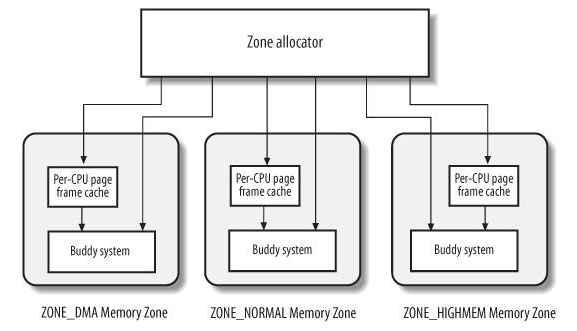

---
categories:
- Understand Linux Kernel
date: 2014-03-30T12:04:00
tags:
- linux
- kernel
title: Page frame management
---

## 简介

之前我们说过了[内存编址](),
从中我们知道了,物理地址的最小单位为一个物理页,
大小是4k(小页)/4M(大页)/2M(PAE使能),
那么今天我们来说说在linux kernel中对物理页帧是如何管理的.

## 表示

每个物理页在kernel中都有一个struct page结构体与之对应,
其中记录了该物理页的许多状态:该页中是否保存着数据,
该页是否可回收,该页在页表中是否被映射等等.

同时,所有的struct page都存放在一个全局数组中(mem_map)

```
struct page *mem_map;
```

这样,如果我们知道了struct page在数组中的index,
就可以得到页描述符了(struct page),
这里的index,我们有个专门的名称:页帧号.

说到这里,有必要说下2个转换宏:

- virt_to_page(addr): 通过线性地址得到对应的物理页描述符.
- page_to_virt(page): 通过物理页描述符得到其对应的线性地址.

这里实现的原理都是通过先将其转换为对应的页帧号:

```
#define virt_to_page(addr)	pfn_to_page(virt_to_pfn(addr))
#define page_to_virt(page)	pfn_to_virt(page_to_pfn(page))
```

首先是将一个线性地址转化为页帧号:

```
#define virt_to_pfn(kaddr)	(__pa(kaddr) >> PAGE_SHIFT)
```

可以看出这里首先得到其对应的物理地址,之后除以一个物理页的大小.

接着,来看下一个物理页描述符如何转换成其对应的页帧号,
这里比较简单,通过和数组第一个元素的地址做比较就可以得出:

```
#define __page_to_pfn(page)	((unsigned long)((page) - mem_map) + \
				 ARCH_PFN_OFFSET)
```

这里的ARCH_PFN_OFFSET对于x86平台来说为0.

## 组织

通常来说,物理内存的分布是连续的,但是,这只是通常情况,
在一些架构下(例如Alpha,Mips等),这种假设是不成立的,
当然,今年来有些cpu已经支持内存条的热插拔,
所以物理内存大小以及分布都是动态了.

这样,非同一内存访问(NUMA)的概念便随之出现,
在这种模型下,对于每个cpu访问分布在不同位置的物理内存
的时间是变化的,系统的物理内存也被分成了几个部分,
cpu对处于同一部分的内存单元的访问时间是相同的,
这里的不同部分,在kernel中抽象为不同的node,
用pg_data_t结构体表示.

在每个node中,根据物理地址范围和作用,
又分为不同的zone,一般来说分为3个zone:

- ZONE_DMA(0-16Mb): 用于兼容老的ISA设备的DMA,
- ZONE_NORMAL(16Mb-kernel地址空间可直接映射的最大地址):对于32bit的x86架构该最大地址为896Mb,对于64bit则为其最大的物理地址.
- ZONE_HIGHMEM: kernel地址空间无法直接建立映射的地址范围,对于64bit的x86架构该zone为空.

## 分配

下面我们就来说说,物理页的申请和释放,
这部分工作是由每个zone自己管理的:



这里,为了防止外碎片的产生,zone_allocator采用了buddy算法,
其主要思想是尽量分配符合申请大小的连续物理页,如果没有,
那么从更大连续的物理页中切分出一块,
当然,如果有两块物理地址连续的小的物理页,
在释放时会将其合并成一个大物理页.

可以看出这里分配的最小单位是一个page,
每个zone都会维护一个以页为单位的不同大小的area(free_area),
例如第一个area中都是大小为1`(2**0)`个页的空闲页,
而第二个area中则是大小为2`(2**1)`个页的空闲页,
以此类推,一般来说会有11个这样的area,
也就是说最大可以获得`(2**11)`大小的连续的物理页,
当然该值也是是可以配置的.

好了,下面我就来从buddy系统中申请一块连续的页是如何实现的.
在看具体的代码之前,我们可以想象大致的逻辑是这样的:
从满足申请大小的最小的area中寻找空闲的页,
如果正好有,那么直接返回即可,反之,
在较大的area中裁剪一块,并将剩下的部分放入较小的area中.
这也就是buddy系统一般的申请流程.

具体的代码如下:

```
/* Find a page of the appropriate size in the preferred list */
for (current_order = order; current_order < MAX_ORDER; ++current_order) {
	area = &(zone->free_area[current_order]);
	if (list_empty(&area->free_list[migratetype]))
		continue;

	page = list_entry(area->free_list[migratetype].next,
						struct page, lru);
	list_del(&page->lru);
	rmv_page_order(page);
	area->nr_free--;
	expand(zone, page, order, current_order, area, migratetype);
	return page;
}
```

这里的 `migratetype` 大家可以先暂时忽略,后面会有介绍.
这里 `rmv_page_order` 需要注意下,
因为buddy系统实现的需要,我们需要记录两个信息:
每个buddy的开始位置,以及该buddy的大小.
其中的buddy开始位置标记记录在 `page->_mapcount` 中:
用 `PAGE_BUDDY_MAPCOUNT_VALUE` 表示:

```
 * PAGE_BUDDY_MAPCOUNT_VALUE must be <= -2 but better not too close to
 * -2 so that an underflow of the page_mapcount() won't be mistaken
 * for a genuine PAGE_BUDDY_MAPCOUNT_VALUE. -128 can be created very
 * efficiently by most CPU architectures.
 */
#define PAGE_BUDDY_MAPCOUNT_VALUE (-128)
```

而buddy的大小,则记录在 `page->private` 中,

所以这里的 `rmv_page_order` 实质就是清除这两个信息.

再得到所需的页之后,我们调用了 `expand` 函数,
该函数的作用就是我们所说的分割,
在进入该函数之前,我们有比较先对传入的参数的做个大概的介绍,
总共有6个参数:

```
static inline void expand(struct zone *zone, struct page *page,
	int low, int high, struct free_area *area,
	int migratetype)
```

- `zone` : 当前所在的zone.
- `page` : 分配的连续的页的首页.
- `low` : 满足分配大小的最小的area的大小.
- `high` : 实际分配的page来自的area的大小.
- `area` : 实际分配的page来自的area.
- `migratetype` : 暂时忽略.

可见,如果page刚好来自满足大小的最小的area,那么 `low==high`.
反之,则需要进行分割了:

```
while (high > low) {
	area--;
	high--;
	size >>= 1;
	VM_BUG_ON(bad_range(zone, &page[size]));

	list_add(&page[size].lru, &area->free_list[migratetype]);
	area->nr_free++;
	set_page_order(&page[size], high);
}
```

可见,每次分出当前大小一半的page放入当前的area中,
以此类推.

## 释放

释放的逻辑是这样的,首先寻找即将释放的页的buddy释放也同样空闲,
如果是的话,将两者合并成一个更大的空闲页,继续向上寻找buddy,
直到找不到为止

```
while (order < MAX_ORDER-1) {
	buddy_idx = __find_buddy_index(page_idx, order);
	buddy = page + (buddy_idx - page_idx);
	if (!page_is_buddy(page, buddy, order))
		break;
	/*
	 * Our buddy is free or it is CONFIG_DEBUG_PAGEALLOC guard page,
	 * merge with it and move up one order.
	 */
	if (page_is_guard(buddy)) {
		clear_page_guard_flag(buddy);
		set_page_private(page, 0);
		__mod_zone_freepage_state(zone, 1 << order,
					  migratetype);
	} else {
		list_del(&buddy->lru);
		zone->free_area[order].nr_free--;
		rmv_page_order(buddy);
	}
	combined_idx = buddy_idx & page_idx;
	page = page + (combined_idx - page_idx);
	page_idx = combined_idx;
	order++;
}
set_page_order(page, order);
```

最后还有点,需要注意的是,如果最终得到的buddy并没有空闲,
但是他的buddy却是空闲的,那么,有可能不久他们就将合并,
为了不破外这种合并,我们将当前即将释放的页挂入当前area
空闲链表的尾部,从而降低他被再次利用的概率,因为每次申请都是从
空闲链表的头部开始取的.

```
if ((order < MAX_ORDER-2) && pfn_valid_within(page_to_pfn(buddy))) {
	struct page *higher_page, *higher_buddy;
	combined_idx = buddy_idx & page_idx;
	higher_page = page + (combined_idx - page_idx);
	buddy_idx = __find_buddy_index(combined_idx, order + 1);
	higher_buddy = higher_page + (buddy_idx - combined_idx);
	if (page_is_buddy(higher_page, higher_buddy, order + 1)) {
		list_add_tail(&page->lru,
			&zone->free_area[order].free_list[migratetype]);
		goto out;
	}
}
```

## 策略

由于申请的得到的连续的页帧,可能会用于不同的目的,
有些可能被用于临时内存,所以不就就会释放,
而有些则可能永远都不会被释放,所以如果用于不用目的
页帧都从同样的area pool中分配,一定会导致
效率不高的问题,所以linux kernel在area的基础上,
对于从一块area中的页帧,根据其使用目的又分成了
不同的 `migrate` :

```
enum {
	MIGRATE_UNMOVABLE,
	MIGRATE_RECLAIMABLE,
	MIGRATE_MOVABLE,
	MIGRATE_PCPTYPES,	/* the number of types on the pcp lists */
	MIGRATE_RESERVE = MIGRATE_PCPTYPES,
	MIGRATE_TYPES
};
```

根据分配页时的flag,确定从哪个 `migrate` 中开始寻找:

```
/* Convert GFP flags to their corresponding migrate type */
static inline int allocflags_to_migratetype(gfp_t gfp_flags)
{
	WARN_ON((gfp_flags & GFP_MOVABLE_MASK) == GFP_MOVABLE_MASK);

	if (unlikely(page_group_by_mobility_disabled))
		return MIGRATE_UNMOVABLE;

	/* Group based on mobility */
	return (((gfp_flags & __GFP_MOVABLE) != 0) << 1) |
		((gfp_flags & __GFP_RECLAIMABLE) != 0);
}
```

由于引入 `migrate` 的概念,势必会导致从一个 `migrate` 中
申请失败的情况,这里kernel采用了一定的fallback的策略,
尝试从其他 `migrate` 中去申请, 对于不同的 `migrate`
有不同的fallback尝试顺序:

```
/*
 * This array describes the order lists are fallen back to when
 * the free lists for the desirable migrate type are depleted
 */
static int fallbacks[MIGRATE_TYPES][4] = {
	[MIGRATE_UNMOVABLE]   = { MIGRATE_RECLAIMABLE, MIGRATE_MOVABLE,     MIGRATE_RESERVE },
	[MIGRATE_RECLAIMABLE] = { MIGRATE_UNMOVABLE,   MIGRATE_MOVABLE,     MIGRATE_RESERVE },
	[MIGRATE_MOVABLE]     = { MIGRATE_RECLAIMABLE, MIGRATE_UNMOVABLE,   MIGRATE_RESERVE },
	[MIGRATE_RESERVE]     = { MIGRATE_RESERVE }, /* Never used */
};
```

FIN.
