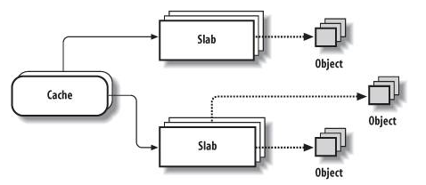
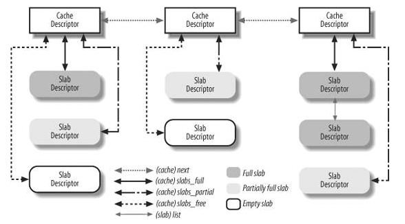
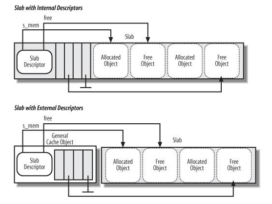
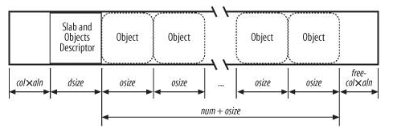

---
categories:
- Understand Linux Kernel
date: 2014-07-14T13:00:00
tags:
- linux
- kernel
title: Memory Area Management - The Slab Allocator
---

## 简介

传统的基于buddy系统的page allocator对于小于page大小的对象的分配和释放
显得效率很低,同时也产生了很多内存碎片,所以基于memory area的分配器
应运而生,slab便是其中之一.

slab将 `objects` 分为一个个的组,俗称 `cache` , 每个 `cache` 中包含的
`object` 都是同样的数据类型.
而每个 `cache` 所使用的内存区域被分为一个个的 `slabs` ,
而每个 `slab` 是由一个或多个连续的物理页组成,
其中包含已经分配的和未使用的 `objects`.



## Cache

`cache` 被分为两种类型:

- general: 这些类型的cache只被slab内部自己使用.
- specific: 除了slab内部,适用于其他所有地方.

`general` `cache` 中主要有下面2个:

- `kmem_cache` 为最初的一个 `cache`, 该 `cache` 在系统初始化时就静态存在, 用于分配 `cache` `descriptor` 结构.(可以理解成万物之主...)
- 一系列固定大小的 `caches`, 一般的大小为32, 64, 128..., 当kmalloc分配一块内存区域时,会从其中合适的 `cache` 中分配.当然,对于有DMA需要的内存区域,同样存在一个 `cache` 与之对应.

对于每个 `cache` 会存在3条链表:

- `slabs_partial:` 每个slab中既有空闲的区域也有已经分配的 `objects`
- `slabs_full:` 每个slab中已经没有空闲的区域
- `slabs_free:` 每个slab都是完全空闲



## Slab

每个slab都有一个slab descriptor:

```
struct {
	struct list_head list; // 用于挂载到cache中的3个链表
	unsigned long colouroff; // 该slab中第一个object的偏移
	void *s_mem;		// 该slab中第一个object的地址
	unsigned int inuse;	// 该slab中正被使用的object的个数
	kmem_bufctl_t free; // 该slab中下一个未被使用的object的index,如果没有则为BUFCTL_END
	unsigned short nodeid; // NUMA中该slab对应的节点
};
```

该数据结构有可能存放在2个地方:申请的slab区域开头或者不在申请的slab内存区域内.
这里主要考虑到内部碎片的问题. `CFLAG_OFF_SLAB` 标记用于指定slab
descriptor是否在slab内.

同样,每个 `object`也有一个descriptor:

```
typedef unsigned int kmem_bufctl_t;
```

该标记只有在该 `object` 被置为free时才有意义,
此时它的值为在它后一个free的 `object` 的index.
当然,每个slab的 `objects` `descriptors` 紧挨着
slab descriptor.



### Slab Coloring

我们知道,一个硬件cache line可能映射到不同的物理内存单元,
这里,不同slab中相同偏移的object就有很高的几率被映射到相同的cache line中.
这样同一个cache line将会反复切换以映射到对应的内存区域,
导致cache line效率很低.
slab allocator尝试降低这样的概率从而最大程度的发挥cache的功能,
因此slab coloring技术被引入,旨在降低不同slab的object被映射到相同cache
line的概率.

首先我们得知道 `object` 在slab中是如何分布的.
这里我们假设 `object` 地址对齐常量为 `aln`,
除此之外 `object` 的分布还和以下几个因素有关:

- `num:` 每个slab中可以容纳的 `object` 的个数(cache->num)
- `osize:` 每个 `object` 的大小,包括用于地址对齐的字节.
- `dsize:` slab descriptor的大小,加上object descriptor的大小,最终的大小和硬件cache line大小对齐.如果slab descriptor不在slab内部,改大小则为0.
- `free:` slab中未被使用的大小.

最终的每个slab的大小可以表示为:
`slab_length` `=` `(num` `*` `osize)` `+` `dsize` `+` `free`

这里slab allocator利用 `free` 的大小来做文章,
这里可用的color的个数为 `free/aln`,
这样每个slab都会被分配到一个属于自己的color,
从0到 `(free/aln)-1`, 而这个值就是在每个slab开头空出的字节数( `col*aln` ),
从而达到coloring的目的.



### Allocating a Slab to a Cache

一个新创建的 `cache` 没有任何slab,因此也就没有任何空闲的 `object`.
只有同时满足以下两个条件时,新的 `slab` 才会被分配给一个 `cache`:

- 尝试分配一个新的 `object`
- 那个 `cache` 没有空闲的 `object`

这里slab allocator通过调用 `cache_grow` 添加一个新的 `slab`

首先计算新申请的 `slab` 的color值:

```
n = cachep->node[nodeid];
spin_lock(&n->list_lock);

/* Get colour for the slab, and cal the next value. */
offset = n->colour_next;
n->colour_next++;
if (n->colour_next >= cachep->colour)
	n->colour_next = 0;
spin_unlock(&n->list_lock);

offset *= cachep->colour_off;
```

接着, 通过 `kmem_getpages` 与zone page allocator交互,
分配获得所需的物理页.
这里的流程与一般的 `alloc_pages` 类似,
只不过申请出来的物理页都被打上了 `slab` `flag`.

```
if (!objp)
	objp = kmem_getpages(cachep, local_flags, nodeid);
if (!objp)
	goto failed;
```

接下来,需要初始化slab descriptor,
这里,需要注意的是,如果slab descriptor不在slab内,
需要从 `cachep->slabp_cache` 这个特殊的 `cache` 中分配.
如果slab descriptor在slab内部, 则从slab开头偏移color即可.

```
if (OFF_SLAB(cachep)) {
	/* Slab management obj is off-slab. */
	slabp = kmem_cache_alloc_node(cachep->slabp_cache,
				      local_flags, nodeid);
```

```
	if (!slabp)
		return NULL;
} else {
	slabp = objp + colour_off;
	colour_off += cachep->slab_size;
}
```

下面的工作是建立申请出来的物理页和slab以及cache之间的联系,
这里主要通过page结构体中的两个指针:

```
do {
	page->slab_cache = cache;
	page->slab_page = slab;
	page++;
} while (--nr_pages);
```

接着,初始化该slab中所有的objects,
这里主要有两部分工作,一是执行用户指定的初始化流程,
二是初始化object descriptor:

```
for (i = 0; i < cachep->num; i++) {
	void *objp = index_to_obj(cachep, slabp, i);
```

```
if (cachep->ctor)
	cachep->ctor(objp);
```

最终,将初始化好的slab,挂入到该节点的空闲链表中:

```
list_add_tail(&slabp->list, &(n->slabs_free));
STATS_INC_GROWN(cachep);
n->free_objects += cachep->num;
```

### Releaseing a Slab from a Cache

Slab可能在下面两种case下从一个cache中释放:

- 在 `cache` 上有太多的空闲 `objects`
- 一个周期性的timer,清理那些没人用的slabs

slab释放的流程比较简单,释放物理页,
同时,如果slab descriptor来自特殊的 `cache`,
也将其释放:

```
kmem_freepages(cachep, addr);
if (OFF_SLAB(cachep))
	kmem_cache_free(cachep->slabp_cache, slabp);
```

## Local Caches of Free Slab Objects

由于多cpu系统的出现,为了减少cpu间的没必要的相互竞争,
同时为了更好的利用硬件cache,每个slab cache为每个cpu
维护一个自己的本地缓存,俗称 `slab` `local` `cache`.
大部分的 `object` 的申请和释放只会影响本地缓存,
只有当本地缓存为空或者溢出时,才会牵扯到slab allocator.
(这里的技术和[上一篇]()
有异曲同工之处)

其中每个cpu的本地缓存由 `struct` `array_cache` 描述:

```
struct array_cache {
	unsigned int avail; // 该缓存中可用的空闲的object,同时也表示第一个空闲的object的index
	unsigned int limit; // 该缓存中可以容纳的最多的空闲的object个数
	unsigned int batchcount; // 清空或充填该缓存是搬运的object的个数
	unsigned int touched; // 表明该缓存最近是否被用到
	spinlock_t lock;
	void *entry[];	// 缓存中object的指针数组
};
```

## Allocating a Slab Object

有了上面的这些理解,下面我来看下从一个 `cache` 中分配一个 `object` 的流程.

首先找到该尝试从该cpu的本地缓存中查找空闲的 `object`:

```
ac = cpu_cache_get(cachep);
if (likely(ac->avail)) {
	ac->touched = 1;
	objp = ac_get_obj(cachep, ac, flags, false);
```

首先将该缓存置为 `touched` 状态,
接着在缓存数组中取出一个元素,并将相应的 `index` 更新:

```
objp = ac->entry[--ac->avail];
```

如果找到,那么直接返回,否则,则需要重填本地缓存:

```
	if (objp) {
		STATS_INC_ALLOCHIT(cachep);
		goto out;
	}
	force_refill = true;
}

STATS_INC_ALLOCMISS(cachep);
objp = cache_alloc_refill(cachep, flags, force_refill);
```

下面我们来看看回填的流程.
如果该节点可以通过一个全局的共享缓存中获取一定数量的缓存 `object`
那么我们就没有必要和真正的 `slab` 交互,这里也存在优化的影子:

```
/* See if we can refill from the shared array */
if (n->shared && transfer_objects(ac, n->shared, batchcount)) {
	n->shared->touched = 1;
	goto alloc_done;
}
```

这里主要是 `object` 指针的copy,注意这里copy的个数是
共享数组中的空闲的 `object` 个数( `from->avail` ),
这次最多copy多少个 `object` ( `max` ),
以及本地缓存中可容纳的 `object` 的个数 ( `to->limit` `-` `to->avail` )
这三者的最小值.

```
static int transfer_objects(struct array_cache *to,
		struct array_cache *from, unsigned int max)
{
	/* Figure out how many entries to transfer */
	int nr = min3(from->avail, max, to->limit - to->avail);

	if (!nr)
		return 0;

	memcpy(to->entry + to->avail, from->entry + from->avail -nr,
			sizeof(void *) *nr);

	from->avail -= nr;
	to->avail += nr;
	return nr;
}
```

如果没有共享缓存可用,那么我们只能去真正的slab中分配了.
首先找一个部分空闲的slab,如果没有,则找一个完全空闲的slab,
如果还是没有,那么我们只能申请一块新的slab了:

```
entry = n->slabs_partial.next;
if (entry == &n->slabs_partial) {
	n->free_touched = 1;
	entry = n->slabs_free.next;
	if (entry == &n->slabs_free)
		goto must_grow;
}

slabp = list_entry(entry, struct slab, list);
```

下面便是将 `object` 从 `slab` 上搬到缓存中了,
直到该slab上没有空闲的空间了或者达到需要搬移的 `object` 的个数:

```
while (slabp->inuse < cachep->num && batchcount--) {
	STATS_INC_ALLOCED(cachep);
	STATS_INC_ACTIVE(cachep);
	STATS_SET_HIGH(cachep);

	ac_put_obj(cachep, ac, slab_get_obj(cachep, slabp,
							node));
}
```

这里分为两步,第一步是从slab上取走一个 `object`:

```
static void *slab_get_obj(struct kmem_cache *cachep, struct slab *slabp,
				int nodeid)
{
	void *objp = index_to_obj(cachep, slabp, slabp->free);
	kmem_bufctl_t next;

	slabp->inuse++;
	next = slab_bufctl(slabp)[slabp->free];
#if DEBUG
	slab_bufctl(slabp)[slabp->free] = BUFCTL_FREE;
	WARN_ON(slabp->nodeid != nodeid);
#endif
	slabp->free = next;

	return objp;
}
```

这里主要是更新slab的 `inuse` 和 `free` 计数.

第二步就是将得到的 `object` 放入到缓存中:

```
ac->entry[ac->avail++] = objp;
```

由于从slab搬移了一些 `objects`, 需要重新将该 `slab`
放入到正确的链表中,如果该slab上已经没有空闲的空间,
则放入到 `slabs_full` 上,否则则放入到 `slab_partial` 上.

```
list_del(&slabp->list);
if (slabp->free == BUFCTL_END)
	list_add(&slabp->list, &n->slabs_full);
else
	list_add(&slabp->list, &n->slabs_partial);
```

最终,我们再次尝试从本地缓存中获取 `object` 并返回,
这次该缓存中已经有了我们回填的 `object` 了.

```
return ac_get_obj(cachep, ac, flags, force_refill);
```

至此,申请一个 `object` 的流程结束.

## Freeing a Slab Object

和分配一个 `object` 类似,释放一个 `object` 首先会放入本地缓存中,
不过再放入之前,如果本地缓存已经满了,我们需要将其中部分 `object`
放入到 `slab` 中.

```
cache_flusharray(cachep, ac);
```

同理,如果有共享缓存,优先释放给它:

```
if (n->shared) {
	struct array_cache *shared_array = n->shared;
	int max = shared_array->limit - shared_array->avail;
	if (max) {
		if (batchcount > max)
			batchcount = max;
		memcpy(&(shared_array->entry[shared_array->avail]),
		       ac->entry, sizeof(void *) * batchcount);
		shared_array->avail += batchcount;
		goto free_done;
	}
}
```

否则,我们需要将其释放给真正的 `slab`:

```
free_block(cachep, ac->entry, batchcount, node);
```

这里首先找到 `object` 所属的 `slab`:

```
slabp = virt_to_slab(objp);
```

```
static inline struct slab *virt_to_slab(const void *obj)
{
	struct page *page = virt_to_head_page(obj);

	VM_BUG_ON(!PageSlab(page));
	return page->slab_page;
}
```

可以看出,这里先找到该object所属的物理页,
再通过其找到所属的 `slab`.

下面就需要调整 `slab` 所属的链表了,
如果一个从半空闲的slab变成了完全的空闲的slab,
那么就需要将其放入 `slabs_free` 上.
不过,如果该 `cache` 上有太多空闲的 `objects`
那么直接将slab整个释放.

```
if (slabp->inuse == 0) {
	if (n->free_objects > n->free_limit) {
		n->free_objects -= cachep->num;
		/* No need to drop any previously held
		 * lock here, even if we have a off-slab slab
		 * descriptor it is guaranteed to come from
		 * a different cache, refer to comments before
		 * alloc_slabmgmt.
		 */
		slab_destroy(cachep, slabp);
	} else {
		list_add(&slabp->list, &n->slabs_free);
	}
```

当然,如果该slab上任然有正被使用的 `objects`,
将其放入 `slabs_partial`.

```
} else {
	/* Unconditionally move a slab to the end of the
	 * partial list on free - maximum time for the
	 * other objects to be freed, too.
	 */
	list_add_tail(&slabp->list, &n->slabs_partial);
}
```

由于我们之前是从本地缓存的开头开始释放 `objects`,
在释放结束后,我们需要调整本地缓存中剩余的 `objects`
的位置,将其搬移到缓存的开头.

```
ac->avail -= batchcount;
memmove(ac->entry, &(ac->entry[batchcount]), sizeof(void *)*ac->avail);
```

最终,本地缓存中有了空闲的位置可以容纳需要释放的 `object`,
将其放入即可:

```
ac_put_obj(cachep, ac, objp);
```

至此,释放一个 `object` 的流程结束.

FIN.
