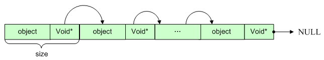

---
categories:
- learning
date: 2014-10-16T13:00:00
tags:
- linux
- kernel
title: Memory Area Management - The Slub Allocator
---

## 基本概念

在深入介绍 `slub` 之前,我们首先需要了解其中的几个基本概念.

### kmem_cache_cpu

由于cpu cache 本地性的影响,当申请的资源都在cpu本地的cache中,
memory的读写效率会很高,这里 `slub` 抽象出了这个概念,在代码中
用 `kmem_cache_cpu` 表示:

```
struct kmem_cache_cpu {
	void **freelist;	// 指向下一个可用的空闲对象
	unsigned long tid;	// 全局唯一的操作id
	struct page *page;	// 当前slab所属的物理页
	struct page *partial;	// 在当前cpu本地,部分空闲的slab 链表
#ifdef CONFIG_SLUB_STATS
	unsigned stat[NR_SLUB_STAT_ITEMS]; // 状态统计信息
#endif
};
```

这里需要介绍下一个 `slab` 中的 `objects` 是如何组织的:



可以看出每个 `object` 末尾都有个指针,指向下一个 `object`.

还有一点需要注意的是,这里的 `slab` 其实是用 `page` 结构来组织的,
我们来看page结构体中相关的字段:

```
struct page {
	...
	struct {
		union {
			...
			void *freelist;		// 指向该物理页上的下一个空闲的object
			...
		};

		union {
			unsigned counters; // 相关的计数,具体见下面3个字段

			struct {
				union {
					...
					struct {
						unsigned inuse:16; // 该物理页上正在使用的object的个数
						unsigned objects:15; // 该物理页上可以容纳的object的个数
						unsigned frozen:1; // 该物理页是否被锁定
					};
					...
				};
				...
			};
			...
		};
	};

	union {
		...
		struct {
			struct page *next;	// 指向下一个slab
			int pages;	// 在该物理页之后还有多少个空闲的slab
			int pobjects;	// 在该物理页之后剩余的空闲的object的个数
		};
		...
	};

	union {
		...
		struct kmem_cache *slab_cache;	// 指向所属的cache
		...
	};
	...
}
```

### kmem_cache_node

为了支持[NUMA](https://en.wikipedia.org/wiki/Non-uniform_memory_access),
`slub` 对于每个内存节点,抽象出了 `kmem_cache_node` 与之对应:

```
struct kmem_cache_node {
	spinlock_t list_lock; // 对该节点进行操作，所需要获得的锁

#ifdef CONFIG_SLUB
	unsigned long nr_partial; // 该节点上部分空闲的slab的个数
	struct list_head partial; // 该节点上部分空闲的slab的链表
#ifdef CONFIG_SLUB_DEBUG
	atomic_long_t nr_slabs; // 该节点上所有类型的slab的个数
	atomic_long_t total_objects; // 该节点上包含的对象的个数
	struct list_head full; // 该节点上被完全使用的slab的链表
#endif
#endif

};
```

可以看出这里只维护了部分空闲以及非空闲的 `slabs` .

### kmem_cache

`kmem_cache` 是从[slab]()
中引入的概念,我们来看 `slub` 是如何实现它的:

```
struct kmem_cache {
	struct kmem_cache_cpu __percpu *cpu_slab; // cpu本地节点数组
	unsigned long flags; // slub相关的标志
	unsigned long min_partial; // 每个NUMA node上至少存在的部分空闲的slab
	int size;		// 每个object的大小+其他记录信息
	int object_size;	// 每个object的大小
	int offset;		// 指向下个空闲object的指针据开头的偏移
	int cpu_partial;	// 每个cpu本地最多存放的object的个数
	struct kmem_cache_order_objects oo; // 每个slab中的object的个数

	/* Allocation and freeing of slabs */
	struct kmem_cache_order_objects max; // 每个slab中最多存放的object的个数
	struct kmem_cache_order_objects min; // 每个slab中至少存放的object的个数
	gfp_t allocflags;	// 分配实际物理页时的标志
	int refcount;		// 对该cache的引用的计数
	void (*ctor)(void *); // 用于初始化每个object
	int inuse;		// 每个object中实际使用的大小
	int align;		// 对齐要求
	int reserved;		// 在每个slab末尾保留的大小
	const char *name;	// 名字
	struct list_head list;	// cache 链表
	struct kmem_cache_node *node[MAX_NUMNODES]; // 每个NUMA node节点数组
};
```

下面我们结合申请和释放的流程来熟悉整个 `slub` 对内存的管理.

## 申请

首先尝试在本地cpu中寻找可用的空闲的 `object`,
当然,在这之前需要确定当前的 `cpu`,
以及当前的操作 `id`, 该 `id` 对于每个 `cpu` 是唯一的:

```
preempt_disable();
c = __this_cpu_ptr(s->cpu_slab);
tid = c->tid;
preempt_enable();
```

确定了 `cpu`, 下面便是查看它上面是否有空闲的 `object`

```
object = c->freelist;
page = c->page;
```

如果有的话,更新下一个空闲的 `object` 指针以及全局的操作 `id` :

```
void *next_object = get_freepointer_safe(s, object);

if (unlikely(!this_cpu_cmpxchg_double(
		s->cpu_slab->freelist, s->cpu_slab->tid,
		object, tid,
		next_object, next_tid(tid)))) {

	note_cmpxchg_failure("slab_alloc", s, tid);
	goto redo;
}
```

如果当前 `cpu` 没有空闲的 `object`, 或者 `object` 所属的物理页和
要求的 `NUMA` 节点不同,那么我们需要从其他 `NUMA` 节点申请(也就是所谓的慢路).
当然, 如果其他节点也没有满足条件的空闲的 `object`,
那么我们就需要申请新的 `slab` 了.

```
if (unlikely(!object || !node_match(page, node)))
	object = __slab_alloc(s, gfpflags, node, addr, c);
```

进入慢路之后,首先会关中断,
之后为了防止在关中断的过程中被重新调度需要重新读取该 `cpu` 上的
空闲的 `object` `list` ,因为可能在这过程中,别的线程恰巧释放了一些空闲的
`object`, 如果有空闲的 `object` ,我们就可以直接从其中获取.
反之,我们就需要获得新的 `slab`.

```
freelist = c->freelist;
if (freelist)
	goto load_freelist;

stat(s, ALLOC_SLOWPATH);

freelist = get_freelist(s, page);

if (!freelist) {
	c->page = NULL;
	stat(s, DEACTIVATE_BYPASS);
	goto new_slab;
}

stat(s, ALLOC_REFILL);

load_freelist:
/*
 * freelist is pointing to the list of objects to be used.
 * page is pointing to the page from which the objects are obtained.
 * That page must be frozen for per cpu allocations to work.
 */
VM_BUG_ON(!c->page->frozen);
c->freelist = get_freepointer(s, freelist);
c->tid = next_tid(c->tid);
local_irq_restore(flags);
return freelist;
```

### deactive a slab

当然,如果当前 `slab` 所属的 `NUMA` `node` 和要求的不一致,
我们同样需要获得新的 `slab` ,不过在这之前,需要将当前的 `slab` `deactive`
掉.这里的 `deactive` 其实是将该 `slab` 从本地 `cpu` 转移到其所属的 `NUMA`
`node` 上.

```
if (unlikely(!node_match(page, node))) {
	stat(s, ALLOC_NODE_MISMATCH);
	deactivate_slab(s, page, c->freelist);
	c->page = NULL;
	c->freelist = NULL;
	goto new_slab;
}
```

下面我们来看下 `deactive` 的过程,首先将 `cpu` 本地的空闲的 `objects`
归还给 `page`, 最终,只有一个空闲的 `object` 保留在 `cpu` 本地.

```
while (freelist && (nextfree = get_freepointer(s, freelist))) {
	void *prior;
	unsigned long counters;

	do {
		prior = page->freelist;
		counters = page->counters;
		set_freepointer(s, freelist, prior);
		new.counters = counters;
		new.inuse--;
		VM_BUG_ON(!new.frozen);

	} while (!__cmpxchg_double_slab(s, page,
		prior, counters,
		freelist, new.counters,
		"drain percpu freelist"));

	freelist = nextfree;
}
```

下面我们需要将最后一个 `object` 归还,
这里为什么没有在上一步做这件事,原因在于,我们还需要将 `page` `unfrozen`
同时将该 `page` 挂入到合适的链表.

所以,这里的第一件是决定最终的 `page` 的状态:

```
old.freelist = page->freelist;
old.counters = page->counters;
VM_BUG_ON(!old.frozen);

/* Determine target state of the slab */
new.counters = old.counters;
if (freelist) {
	new.inuse--;
	set_freepointer(s, freelist, old.freelist);
	new.freelist = freelist;
} else
	new.freelist = old.freelist;

new.frozen = 0;
```

这里需要注意的是,当 `page` 被归还给 `NUMA` `node` 后,其状态变成了 `unfrozen`.

下面便是选择一个合适的链表将其挂入.
首先,如果该 `page` 里没有正在使用的 `object` 同时 `NUMA` `node` 上空闲的
`pages` 的个数大于我们设定的阈值,我们选择将该 `page` 直接释放给 `zone` `page`
`alloctor`

```
if (!new.inuse && n->nr_partial > s->min_partial)
	m = M_FREE;
```

否则,将其挂入到 `NUMA` `node` 的 `partial` 链表上.

```
else if (new.freelist) {
	m = M_PARTIAL;
```

### get a slab

好了,下面我们来看下如何得到一个 `slab` .

这里,我们首先从 `cpu` 本地获取一个部分空闲的 `slab` :

```
if (c->partial) {
	page = c->page = c->partial;
	c->partial = page->next;
	stat(s, CPU_PARTIAL_ALLOC);
	c->freelist = NULL;
	goto redo;
}
```

如果 `cpu` 本地没有可用的 `slab` , 那么我们尝试从指定的 `NUMA` `node` 上获取一个部分空闲的 `slab` .

```
freelist = get_partial(s, flags, node, c);

if (freelist)
	return freelist;
```

```
spin_lock(&n->list_lock);
list_for_each_entry_safe(page, page2, &n->partial, lru) {
	void *t;

	if (!pfmemalloc_match(page, flags))
		continue;

	t = acquire_slab(s, n, page, object == NULL, &objects);
	if (!t)
		break;

	available += objects;
	if (!object) {
		c->page = page;
		stat(s, ALLOC_FROM_PARTIAL);
		object = t;
	} else {
		put_cpu_partial(s, page, 0);
		stat(s, CPU_PARTIAL_NODE);
	}
	if (!kmem_cache_has_cpu_partial(s)
		|| available > s->cpu_partial / 2)
		break;

}
spin_unlock(&n->list_lock);
```

其中, `acquire_slab` 主要是将 `page` 从 `NUMA` `node` 链表中删除,
同时讲其置为 `frozen` 状态.

```
new.frozen = 1;

if (!__cmpxchg_double_slab(s, page,
		freelist, counters,
		new.freelist, new.counters,
		"acquire_slab"))
	return NULL;

remove_partial(n, page);
```

之后将第一个得到的 `page` 设置为 `cpu` 当前正在使用的 `slab`,
其他的 `page` 则挂入到 `cpu` 本地的 `partial` `list` 链表中.

如果没有部分空闲的 `slab` ,那么我们只能想 `zone` `page` `alloctor`
申请新的 `slab` ,同时将新的 `slab` 直接于本地 `cpu` 进行绑定.

```
page = new_slab(s, flags, node);
if (page) {
	c = __this_cpu_ptr(s->cpu_slab);
	if (c->page)
		flush_slab(s, c);

	/*
	 * No other reference to the page yet so we can
	 * muck around with it freely without cmpxchg
	 */
	freelist = page->freelist;
	page->freelist = NULL;

	stat(s, ALLOC_SLAB);
	c->page = page;
	*pc = c;
```

当得到新的 `slab` ,下面便可以直接从其获得空闲的 `object` 返回.

至此申请的流程结束,我们可以将整个的申请流程总结成以下步骤:

- 尝试从本地 `cpu` 的空闲的 `object` 链表获得空闲的 `object` ,如果成功则直接返回.
- 尝试从对应的 `NUMA` `node` 上获得空闲的 `slab` ,这里的获取 `slab` 会优先从 `cpu` 本地的 `partial` `list` 上,然后才是对应的节点的 `partial` `list` ,当获得 了一个 `slab` ,返回步骤一.
- 尝试从 `zone` `page` `allocator` 分配一个新的 `slab` ,成功则返回步骤一.

## 释放

释放的流程和申请类似,如果需要释放的 `object` 所属的 `slab`
与当前本地 `cpu` 上的 `slab` 一致,我们直接将其挂入到其空闲链表中:

```
if (likely(page == c->page)) {
	set_freepointer(s, object, c->freelist);

	if (unlikely(!this_cpu_cmpxchg_double(
			s->cpu_slab->freelist, s->cpu_slab->tid,
			c->freelist, tid,
			object, next_tid(tid)))) {

		note_cmpxchg_failure("slab_free", s, tid);
		goto redo;
	}
	stat(s, FREE_FASTPATH);
```

否则,我们选择将 `object` 释放给其对应的 `slab`,
这里主要是将其挂入 `slab` 的 `freelist` 中,
同时更新相应的计数.

```
prior = page->freelist;
counters = page->counters;
set_freepointer(s, object, prior);
new.counters = counters;
was_frozen = new.frozen;
new.inuse--;
```

之后,如果该 `slab` 之前不在任何链表上,那么我们首先会将其挂入到
当前 `cpu` 本地的 `partial` `list` 上:

```
if (new.frozen && !was_frozen) {
	put_cpu_partial(s, page, 1);
	stat(s, CPU_PARTIAL_FREE);
}
```

反之,如果该 `slab` 所属的 `NUMA` `node` 上的部分空闲的 `slab` 过多,
同时该 `slab` 完全空闲,我们选择直接将其释放给 `zone` `page` `allocator` .

```
if (unlikely(!new.inuse && n->nr_partial > s->min_partial))
	goto slab_empty;
```

否则,我们将其放入对应节点的 `partial` `list` 中.

```
if (!kmem_cache_has_cpu_partial(s) && unlikely(!prior)) {
	if (kmem_cache_debug(s))
		remove_full(s, n, page);
	add_partial(n, page, DEACTIVATE_TO_TAIL);
	stat(s, FREE_ADD_PARTIAL);
}
```

我们先来看如何将其放入 `cpu` 本地,如果之前该 `cpu` 已经有了很多的 `objects`,
那么,我们需要将部分 `slab` 释放掉.

```
oldpage = this_cpu_read(s->cpu_slab->partial);

if (oldpage) {
	pobjects = oldpage->pobjects;
	pages = oldpage->pages;
	if (drain && pobjects > s->cpu_partial) {
		unsigned long flags;
		/*
		 * partial array is full. Move the existing
		 * set to the per node partial list.
		 */
		local_irq_save(flags);
		unfreeze_partials(s, this_cpu_ptr(s->cpu_slab));
		local_irq_restore(flags);
		oldpage = NULL;
		pobjects = 0;
		pages = 0;
		stat(s, CPU_PARTIAL_DRAIN);
	}
}
```

否则挂入到 `cpu` 本地的 `partial` `list`:

```
	pages++;
	pobjects += page->objects - page->inuse;

	page->pages = pages;
	page->pobjects = pobjects;
	page->next = oldpage;

} while (this_cpu_cmpxchg(s->cpu_slab->partial, oldpage, page)
							!= oldpage);
```

好了,下面我来看下如果释放一个空闲的 `slab` 给 `zone` `page` `allocator` ,
首先,我们需要将其从相应的链表中删除:

```
if (prior) {
	/*
	 * Slab on the partial list.
	 */
	remove_partial(n, page);
	stat(s, FREE_REMOVE_PARTIAL);
} else {
	/* Slab must be on the full list */
	remove_full(s, n, page);
}
```

之后我们就可以将该 `slab` 安全的释放了.

好了,我们可以总结下释放的流程:

- 尝试将 `object` 放入到 `cpu` 本地的空闲链表,如果成功则直接返回.
- 将 `object` 释放给其对应的 `slab` ,然后优先将 `slab` 释放给本地 `cpu` ,如果本地 `cpu` 上有过多的 `slab` ，将一部分 `slab` 直接放回给 `zone` `page` `allocator` .
- 如果不能将 `slab` 返回给本地 `cpu` ，我们将其释放给对应的 `NUMA` `node` ，如果对应的节点上有过多的 `slab` ，返回给 `zone` `page` `allocator` .

FIN.
